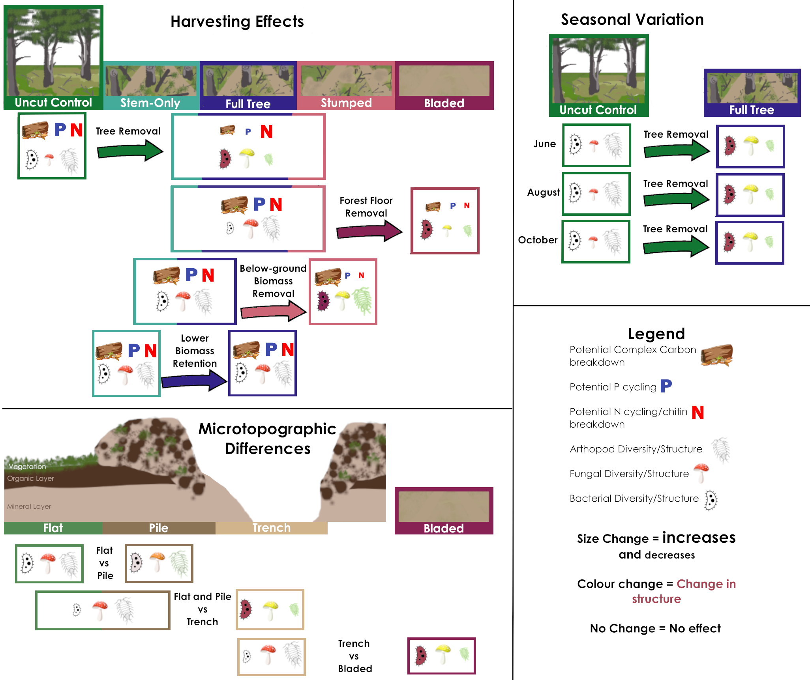
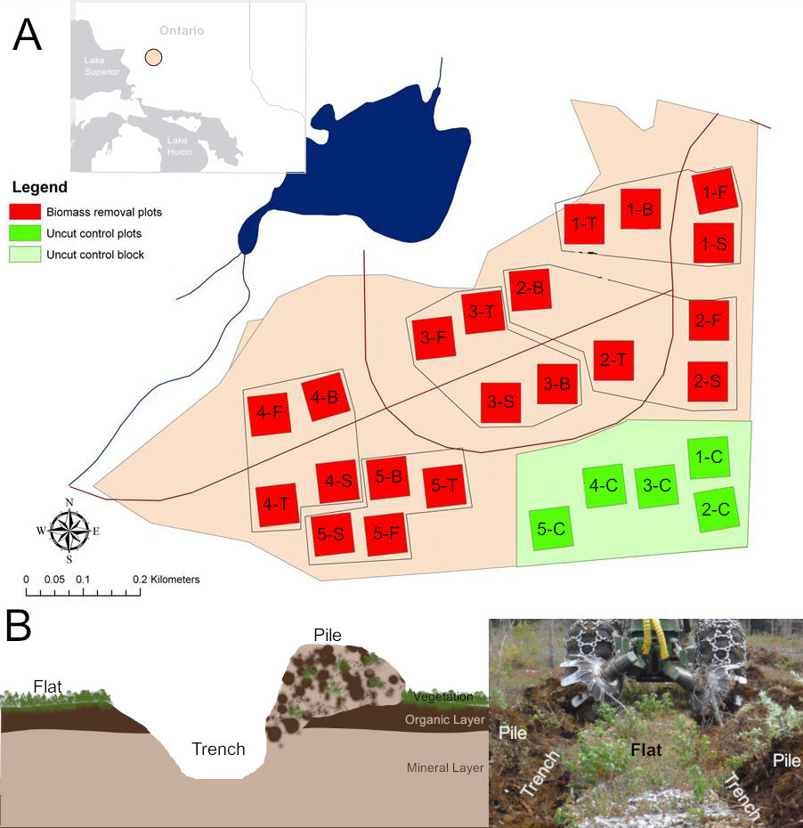

# Abstract {.unnumbered}

The market for forest products has diversified to include biomass energy products sourced from materials that were typically left on-site after harvest. In this study we examined whether intensified biomass removal following harvest will effect site soil biological diversity and metabolic functioning, and how decisions surrounding sampling, in sites prepared with disc-trenching soil scarification, influence the effect assessment of harvesting activities. We compared the influence of harvesting, below-ground biomass removal, stem only versus full tree harvesting, micro-topographic features and seasonal effects on soil biota. We assessed soil biotic changes using potential enzyme activity assays and metabarcoding using targeted primers for four groups (arthropods, bacteria, fungi and broad eukaryotes). We found that harvesting and forest floor removal had strong influences on soil biotic communities, with changes that generally favoured more general soil saprotrophy and reductions in plant-associated organisms. Disc-trenching created differences between micro-topographic features where organic soil was redistributed and trenches, where it was removed. We found no significant difference to how seasonal variation effected communities in harvested sites, compared to unharvested sites. These results show that there is significant site heterogeneity due to disc scarification, and that the sampling micro-topographic features should be considered during study design. Additional studies are needed to assess the effects of higher biomass removal on these features as these sites age. <!---Organic soil components contain many of the plant associated organisms in soil, so the redistribution of existing organic soils have large, potentially long-lasting effects on the soil community. ## Commented this line out at the suggestion of TP--->


Key words: soil, Bacteria, Fungi, Arthropods, Harvesting, Biomass, microtopography, DNA metabarcoding, enzyme activity

```{r graphical-abstract, fig.cap= "Simplified summary of results of the effects of harvesting, microtopographical differences, and seasonal variation on soil potential functions and community diversity and structure.", fig.width= 8, message=FALSE, echo=FALSE}
## include experimental plot design fig from ILBMB report


```


```{r setup, include=FALSE}
knitr::opts_chunk$set(echo = FALSE, fig.width = 8, message = FALSE, warning = FALSE, dev = c('png', "postscript"))

memory.limit(size=30000) ## increase R memory limit

## grab essential libraries
library(tidyverse)
library(ALDEx2)
library(vegan)
library(pheatmap)
library(compositions)
library(readr)
library(ggpubr)
source("src/HelperFunctions_CommunityData.R")

## Load data

for(d in list.files("data", full.names = T)[grepl("RData$", list.files("data", full.names = T))]){
      load(d)
}
rm(d)

## NOTE: while there appears to be Animalia in the 18S dataset, they are included as 'unidentified' ESVs downstream, as they have low identification confidence as Animalia, so they are not mentioned throughout the manuscript. 

metadat$month <- factor(metadat$month, levels = c("June", "August", "October"))
metadat$harvest <- factor(metadat$harvest, levels = c("Full Tree", "Unharvested", "Stem Only", "Stumped", "Bladed"))
metadat$topo[metadat$harvest == "Bladed"] <- "Bladed"


### Prepare taxonomy for Functional assignment information for the different zOTUS
## ITS
FunGuild_data <- ITS[,c("ITS_GlobalESV", "Kingdom", "Phylum", "Class", "Order", "Family", "Genus", "Species")]

colnames(FunGuild_data)[1] <- "OTU ID"

write_delim(FunGuild_data, file("FUNGuild/FunGuild.taxa.txt", encoding="UTF-8"), delim="\t")
 rm(FunGuild_data)

 ## Bacterial
 FaproTax_data <- Bac16S
 colnames(FaproTax_data)[1] <- "OTU ID"

FaproTax_data$Genus <- ifelse(FaproTax_data$gBP >=0.5, FaproTax_data$Genus, "unidentified") 
 ## No Species in bac df

FaproTax_data$taxonomy <- paste(paste("d", FaproTax_data$Domain, sep="__"), 
                                paste("p", FaproTax_data$Phylum, sep="__"),
                                paste("c", FaproTax_data$Class, sep="__"),
                                paste("o", FaproTax_data$Order, sep="__"),
                                paste("f", FaproTax_data$Family, sep="__"),
                                paste("g", FaproTax_data$Genus, sep="__"),
                                sep=";")

FaproTax_data<- FaproTax_data[,c("taxonomy", "OTU ID")]

write_delim(FaproTax_data, file("FAPROTAX_1.2.4/FaproTax_data.tsv", encoding="UTF-8"), delim="\t")
 

## Arthropods
BETSI_search <- str_c(gsub('^undef_', '', c(unique(F230$Phylum), unique(F230$Class), unique(F230$Family), unique(F230$Genus[F230$gBP >= 0.3]), gsub("_", " ", unique(F230$Species[F230$sBP >= 0.7])))),
                      collapse=";")


BETSI_search1 <- str_c(c(unique(F230$Class), unique(F230$Family), unique(F230$Genus[F230$gBP >= 0.3])),
                      collapse=";")

BETSI_species <-  paste(c(gsub("_", " ", unique(F230$Species[F230$sBP >= 0.7]))), ";", sep="")
write(c("Taxon_name", BETSI_species), "BETSI/BETSI_Species_check.csv")

BETSI_species <- readLines("BETSI/transform.csv")[3:81]

species_corrected <- data.frame()

for(sp in BETSI_species){
  species_corrected <-  rbind(species_corrected, 
                              data.frame(original.species = str_split(sp, ";")[[1]][1], Corrected = str_split(sp, ";")[[1]][2]))
}

not_in_BETSI <- paste(sum(species_corrected$Corrected == "")/nrow(species_corrected)*100, "%")

species_corrected <- species_corrected[!species_corrected$Corrected == "", ]

BETSI_species_search <-  str_c(gsub("\t","", species_corrected$Corrected), collapse = ";")

##Conducted search & correction on https://portail.betsi.cnrs.fr/ for diet level 2 and microhabitat level 2

rm(species_corrected, not_in_BETSI, sp, BETSI_species)

## compile metabarcode datasets
metabarcode_sets <- list(Bac16S = Bac16S, ITS = ITS, F230 = F230, Euk18S = Euk18S)
rm(Bac16S, F230, Euk18S, ITS)


ds_list <- list()
count = 1
## Set up metabarcoding datasets for different hypothesis tests
for(ds in c("Bac16S", "ITS", "F230", "Euk18S")){
   for(set in 1:3){
      if(set == 1){toexclude = metadat$sample[!metadat$month == "August"]}
      if(set == 2){toexclude = metadat$sample[!(metadat$harvest %in% c("Unharvested", "Full Tree") & is.na(metadat$topo))]}
      if(set == 3){toexclude = metadat$sample[is.na(metadat$topo)]}
      
      dat = metabarcode_sets[[ds]]
      
      colnames(dat)[1] <- "ESV"
      
      ds_subset <- dat %>% 
         filter(!SampleName %in% toexclude) %>%
         group_by(ESV) %>%
         filter(!sum(ESVsize) == 0) %>% 
         pivot_wider(names_from = SampleName, values_from = ESVsize, values_fill = 0) %>% 
         data.frame()
      
      ds_list[[count]] <- ds_subset
      names(ds_list)[count] <- paste0(ds, "_", set)
      count=count+1
      
      
      ### Add functional & Genus grouping levels as well --> maybe bring that in at a later point if anything found with ESV
   }   
}

rm(metabarcode_sets, ds_subset, dat, ds, count, set, toexclude)

## Set a colorblind-safe palette
cust.cols <- c("#332288", "#117733", "#44AA99", "#88CCEE", "#DDCC77", "#CC6677", "#AA4499", "#882255")

harv.cols <- c(Unharvested = "#117733", `Stem Only`="#44AA99",`Full Tree` = "#332288", Stumped = "#CC6677", Bladed = "#882255")
harv.shapes <- c(Unharvested = 2, `Stem Only` =3, `Full Tree` = 1, Stumped = 5, Bladed =6)

harv.orth.cols <- c(TR = "black", FFR = "#CC6677", BGBR = "#44AA99", BRt = "#117733")
      
topo.ortho.cols <- c(T.B = "#882255", T.PF= "tan", P.F = "burlywood4")

topo.cols <- c(Bladed = "#882255", Flat = "palegreen4", Pile = "burlywood4", Trench = "tan")
topo.shapes <- c(Bladed = 6, Flat = 2, Pile = 3, Trench = 1)

num_p_tests <- 0
figcount <- 1
```

```{asis, eval=FALSE}
## Conducted on Powershell on Windows
## FUNGuild fungi functional assignment
cd FUNGuild

python FUNGuild.py guild -taxa FunGuild.taxa.txt

## Conducted on Powershell on Windows
cd ..\FAPROTAX_1.2.4

## Replaced is not statements with "!="

python collapse_table_v2.py -i FaproTax_data.tsv -g FAPROTAX.txt -f -o functional_otu_table.tsv -r report.txt --column_names_are_in first_data_line  --keep_header_comments --non_numeric consolidate -v --row_names_are_in_column "taxonomy" --omit_columns 0 --normalize_collapsed none --group_leftovers_as 'other'

## Matching was poor- as no id's to species - only 6087, 21452 leftovers

```


```{r taxa-inf}
## Fungi
FunGuild_data <- read.delim("FUNGuild/FunGuild.taxa.guilds.txt")

## Bacteria
FaproTax_data <- read.delim("FAPROTAX_1.2.4/functional_otu_table.tsv", skip = 2)

## Arthropods
## Pull in the Class, Order, Genus search results for diet (includes species within the genus)
unzip("BETSI/BETSI_0_cog_diet.zip", exdir="BETSI")

BETSI_db_res <- read.delim("BETSI/BETSI_A.csv")
BETSI_db_mat <- read.delim("BETSI/BETSI_B.csv")

BETSI_db_mat <- BETSI_db_mat[, 1:(ncol(BETSI_db_mat)-2)]

col_repl <- data.frame(orig=colnames(BETSI_db_mat), row.2 = t(BETSI_db_mat[1,])) %>%
  mutate(grp = cumsum(!grepl("X", orig))) %>%
  group_by(grp) %>%
  mutate(first.term=orig[!grepl('X', orig)])

colnames(BETSI_db_mat) <- c("Taxon", paste(col_repl$first.term, col_repl$X1, sep=".")[2:ncol(BETSI_db_mat)])

BETSI_db_mat_diet <- BETSI_db_mat[2:nrow(BETSI_db_mat),] %>% pivot_longer(-Taxon, values_to = "presence", names_to = "Function")

## Pull in the Class, Order, Genus search results for diet (includes species within the genus)
unzip("BETSI/BETSI_0_cog_microhabitat.zip", exdir="BETSI")

BETSI_db_res <- read.delim("BETSI/BETSI_A.csv")
BETSI_db_mat <- read.delim("BETSI/BETSI_B.csv")

BETSI_db_mat <- BETSI_db_mat[, 1:(ncol(BETSI_db_mat)-2)]

col_repl <- data.frame(orig=colnames(BETSI_db_mat), row.2 = t(BETSI_db_mat[1,])) %>%
  mutate(grp = cumsum(!grepl("X", orig))) %>%
  group_by(grp) %>%
  mutate(first.term=orig[!grepl('X', orig)])

colnames(BETSI_db_mat) <- c("Taxon", paste(col_repl$first.term, col_repl$X1, sep=".")[2:ncol(BETSI_db_mat)])

BETSI_db_mat_microhabitat <- BETSI_db_mat[2:nrow(BETSI_db_mat),] %>% pivot_longer(-Taxon, values_to = "presence", names_to = "Function")

## Combine trait Matrixes

BETSI_db_mat_combined <- rbind(BETSI_db_mat_diet, BETSI_db_mat_microhabitat)

##

BETSI_db_mat_combined <- BETSI_db_mat_combined %>%
  filter(!presence == 0) %>%
  group_by(Taxon) %>%
  summarize(Function = str_c(unique(Function), collapse = "-")) 


rm(BETSI_db_mat_microhabitat, BETSI_db_mat, BETSI_db_mat_diet, BETSI_db_res, col_repl)

```


# Introduction


Forest harvesting in Canada has continued to focus on traditional forest products (i.e., lumber, pulp and paper), with only a minor consideration in the bioenergy stream. While bioenergy has been part of the operational mix in forestry operations in the past (e.g., co-generation feedstock, small - to medium scale commercial and domestic pellet production facilities, some small-scale, community-based heat and power facilities) this market has remained small. The displacement of fossil fuels, and associated financial incentives, may increase the demand for bioenergy products [@berch2011]. One possible feedstock source of this additional wood biomass would likely be through intensification (i.e., high utilization of forest biomass in combination with the harvesting for traditional wood forest products) of existing harvesting operations, utilizing forest biomass that would otherwise be left on site or at roadside [@berch2011; @titus2021]. Ecologically, these removals could be detrimental by removing biomass that would otherwise provide resources to the site. Choosing forestry operations that responsibly increase harvest yields requires evaluation of the ecosystem-level effects of these high utilization options.


Soil communities are becoming more widely considered as indicators of ecosystem change. Arthropods, bacteria and fungi represent components and bottom up drivers of well-functioning forest ecosystems, but may be influenced by changes in the amount of woody residues remaining after disturbance [@lewandowski2019; @webster2021; @venier2017]. All three of these groups have members with the potential to respond to direct or indirect effects of different biomass retention strategies. Arthropod, bacteria, fungi and their functional responses are known to be responsive to moisture and oxygen availability within soil [@blankinship2011; @nielsen2015]. The addition of woody biomass can result in increased shading, changes in albedo, reduced compaction and provide key habitat features [@venier2017]. All of these factors, individually or collectively, can influence community composition, but generally, any ecological effects should first be detected in the smaller, lower trophic level groups. Small, lower trophic level organisms tend to respond more quickly to change because of fast generation times (in the appropriate conditions) and a vast diversity of quiescent taxa and larger populations: e.g., it is estimated that there are up to 10^10^ bacteria in a small sample of soil, comprising up to 10^6^ distinct taxa [@torsvik2002; @whitman1998].


The disturbances caused by clearcut harvesting are not only restricted to biomass removal effects, with larger disturbance footprints resulting in changes to hydrology, soil upheaval and changes to microtopography (e.g. soil turned over into 'piles' or patchy distributions of woody debris) [@lof2012]. Often, in managed forests, site preparation is used to reduce vegetation competition and expose mineral soil for planted seedlings (e.g., Disc trenching is a site preparation technique commonly applied in Canada) that results in flats, trenches and piles of mixed soil (Fig \@ref(fig:site-map)) [@sutherland1995]. These techniques introduce distinct micro-topographic features to sites and disturb existing soil structure. These micro-topographic features can result in measurable changes in nutrient distribution [@johansson1994], which could result in changes to community assemblages, and the specific changes in these features can be masked in any site-level assessments [@schmidtl1996; @levy-booth2016]. 

With respect to the micro-topographic effects of forest site preparation, soil biotic responses have been less studied than larger overall responses to silvicultural activities. There are expectations that there would be biodiversity effects from site preparation, as various soil horizons are known to harbour different soil communities [@chavescardoso2020; @frey2021; @porter2019]. These mechanisms of disturbance can also result in differences in localized microclimate conditions and nutrient reserves; e.g., removal of organic horizons may reduce the water holding capacity, rendering soils more susceptible to water loss during drought conditions and, altering decomposition rates [@jimenezesquilin2008; @lof2012; @webster2016]. It is important to represent these mechanisms to ensure that the results of treatment-level studies are considered in the appropriate context given the selected sampling season and micro-topographic features included in the overall sampling design.

Advancements in high throughput DNA sequencing technology has greatly increased the sensitivity of soil DNA profiling, and increased their affordability, and they are being increasingly applied to forest systems as a result [@porter2018a]. Even today, most soils remain dominated by unknown bacteria, fungi and soil invertebrates, which have not been detected and described through traditional techniques [@mishra2022]. However, through the use of DNA metabarcoding and high-throughput sequencing, we can evaluate whether soil organisms are responding to direct or indirect effects of intensification. Of particular relevance, these technologies may assist in the detection of subtle community responses that were not possible using traditional techniques. Used alongside potential enzyme activities to assess functional response, these techniques provide enhanced insights into changes in the soil ecosystem in response to site level operations.

Our study objective is to assess the impact of harvest (tree removal), alternative intensities of biomass removal, soil disturbance through site preparation and, seasonality on soil biota.  First, we assessed whether five different harvesting intensities/soil disturbance levels resulted in different community compositions and functional responses. Secondly, we assessed whether the choice of micro-topographic features included in our sampling design had an  influence in the interpretation of our results to the extent of altering our conclusions. Thirdly, we assessed whether the timing of our sampling was the best option for capturing the changes in temperature and moisture sensitive soil community indicators. 

<!---
## Hypotheses

1. Compared to Full-tree harvesting, further increased biomass removal (i.e., Stump removal or Blading) has effects on soil communities, whereas reduced biomass removal (i.e., stem only harvesting) results in a shift closer to uncut conditions. 
2. Disc trenching affects community structure related to the resulting micro-topographic features and the redistribution of organic soil results has different effects than complete removal of organic components (i.e. Blading).
3. Seasonal effects are important, and influence the interpretation of results.
--->

# Methods

## Site description

This study was conducted at the Island Lake Biomass Trial sites near Chapleau, Ontario, which have been extensively described [@kwiaton2014a; @venier2017]. In brief, the study site was established in 2011 in a 40 year old second growth jack pine stand. Main treatment plots (70 m by 70 m, with a 10 m surrounding buffer to minimize edge effects) were harvested in the winters of 2010/2011 and included four increasing levels of biomass removal 1) stem-only (leaving the live branches and tops of harvested trees at the stump), 2) full-tree (removing the above ground tree biomass, including the removal of poor or undersized trees), 3) full-tree biomass with stump removal and, 4) blading (removal of all biomass including stumps, downed woody debris and forest floor). All treatments had five replicate plots, with a portion of the stand left in-tact, where uncut control plots were established (Fig \@ref(fig:site-map) B). All treatment plots (excluding bladed plots) were site prepared using a power disc trencher. The main treatment plots were split and planted with either jack pine or black spruce container stock in May 2012. The main plots were then split again, with one half receiving glyphosate treatment. Only the portion of the plot without herbicide were used in this study. 

```{r site-map, fig.cap= "Visual depiction of experimental features A) Map of the Island Lake Biomass Harvest Research and Demonstration Area, modified from Kwiaton et al, (2014) Figure 2.4. For the biomass removal plots, the numbers indicate the block number and the letters indicate the harvest treatment: T = Stem Only, F = Full-tree, S = Stump removal, B = Bladed, C = Uncut Control. The location of the sites in Ontario is provided in a map in the upper left corner. B) Depiction of trench, pile and flat microtopography features.", fig.width= 8}
## include experimental plot design fig from ILBMB report


```


## Soil sampling

The organic horizons (i.e., litter and fermentation-humus horizons) and upper mineral soil were sampled during the 2016 growing season. Each soil sample was collected in a 5cm diameter PVC pipe to a depth of 10 cm. PVC pipes were sanitized with bleach before sampling was performed. All sampling was completed with gloves to reduce cross-contamination. Samples were immediately frozen at -20˚C after sampling and held at that temperature until analysis. All samples were shipped to the Great Lakes Forestry Centre (Sault Ste. Marie) where soils were split into organic and mineral horizons and homogenized according to the experimental design (see below), and subsamples were taken for enzyme and metabarcoding analyses. 

Sampling to assess seasonal effects, harvesting, and microtopography were conducted on the biomass harvesting sites. Seasonal sampling (June, August and October 2016) was conducted on the flats of the full tree biomass and unharvested control plots. Harvesting samples were collected from soils in August 2016 from unharvested control plots and from the flats of the four harvesting treatments. Micro-topographic samples were collected in June 2016 from full tree sites, from three micro-topographic features: flats, where the soil horizons were not disturbed by disc trenching; piles, where a mixure of organic and mineral soil was created from the excavating of the trenches; and, trenches, which consisted of troughs of exposed mineral soil \@ref(fig:site-map) B).  


## Sample Processing

One soil core was taken for each treatment at each plot. Soil cores from all samples were split into organic and mineral fractions and homogenized separately. For comparing the biomass harvesting treatments, and for the seasonal analysis, an organic/mineral soil composite was made by combining 2.5g of both organic and mineral homogenized soils in a clean bag. For microtopography flat samples, the proportion of organic and mineral soils in the sample core were recorded before separation, and re-combined by weight in proportions matching the original proportions in the soil core to a total sample weight of 1g into a clean sample bag. Microtopography pile and trench samples did not have any distinguishable soil horizons in the top 10 cm, 1g of each soil core was sampled into a clean sample bag.


## Enzyme Analyses


Enzyme analyses were performed for the ecologically important enzymes N-acetylglucosaminidase (NAG), phosphatase (PHOS) and xylosidase (XY), which represent measures of potential nitrogen utilization, phosphorus utilization and carbon utilization respectfully [@findlay2007]. All enzyme activities were performed in 96-well plates under controlled conditions using 4-methylumbelliferone-fluorescence tagged substrates (pH 5 and room temperature) and measured with a BioTek Synergy H1 Hybrid spectrophotometer/fluorometer. Incubation times were based on time-trials conducted on a subset of samples. Samples were stored at -20˚C prior to analysis based on existing protocols [@findlay2007; @saiya-cork2002].


## Metabarcoding


DNA extractions were performed using 0.25g of homogenized bulk soil samples using Qiagen DNeasy PowerSoil extraction kits. Extracted DNA was then amplified using primers targeted for specific groups of organisms (Supplemental Materials, Tables S1.1, S1.2). Paired-end sequencing for Arthropods (F230), Fungi (ITS), broad Eukaryotes (all groups with 18S, i.e., Protists, Fungi, Plants) and Bacteria (16S) were performed on the Illumina MiSeq platform in the Hajibabaei lab at the Centre for Biodiversity  Genomics, University of Guelph. A total of ~113 million ~300 bp paired-end reads were generated from 4 amplicons (Supplemental Materials, Table S1.3). Data was processed into ESVs (Exact Sequence Variants) using the MetaWorks pipeline v1.4.0 [@porter2022]. Sequence retention details are provided in Tables S1.3 and S1.4 of the Supplemental Materials. Samples with less than 1000 reads were removed. Taxonomic assignments with at least 80% accuracy were retained using the bootstrap cutoff values for the ITS, COI and 18S classifiers genus level for 200 bp reads. We used a cut off value of 80% for the 16S region as recommended by the RDP classifier documentation. Taxonomy of 16S data was assigned using the RDP 2.1.3 database included with MetaWorksv1.4.0. Taxonomic assignment of 18S sequences was completed with SILVA 138 SSURef Nr99 trained to work with the RDP 2.13 classifier [@wang2007a]. F230 sequences were classified using the CO1 Classifier v4 [@porter2018]. ITS sequences were classified with the UNITE v8.2 ITS reference set database[@koljalg2019; @porter2020a]. <!--- Functional guilds were assigned through FAPROTAX (16S), FUNGuild (ITS) or using the BETSI database (F230) [@FAPROTAX; @nguyen2016; @hedde2012]. A summary of the percent of ESVs identified to Genus using the appropriate cut-off values are provided in Table S1.5 of the Supplemental Materials. --->


## Statistical analysis

All statistical analyses were performed in R version 4.1.1, with graphics construction in ggplot2 version 3.3.6 and ggpubr version 0.4.0 [@R2021; @ggplot22016; @R-ggpubr].


We sought to evaluate community level differences using measures of gamma diversity and community composition. Different diversity metrics have their own biases that can influence the interpretation of results (e.g., Shannon is more sensitive to rare species than inverse Simpsons), by using multiple metrics we were able to observe whether diversity responses were influenced by rare ESVs (Shannon, ESV richness), or more likely were due to broad changes in more dominant groups (Inverse Simpsons). We calculated Shannon, Inverse Simpsons, and ESV richness diversity metrics using the diversity and specnumber functions in the vegan package (version 2.6-2) [@R-vegan], on relative abundance (Bacterial 16S) or presence-absence data (Fungal ITS, Arthropod F230, Eukaryote 18S). To determine whether there were overall community structural differences, centred-log-ratio (clr) values were computed for each experimental set of samples for compositional PCA and RDA analyses by subtracting the log of the mean relative abundance (with zeros replaced with 0.5) for each sample from the log of the relative abundance of each ESV in each sample [@aitchison2000]. The clr transformation was performed as part of a compositional analysis approach, which has been proposed to be more appropriate for analyzing metabarcoding data [@gloor2016; @fernandes2014]. Alternative approaches can involve rarefying and applying analyses on the relative abundance or presence-absence data. We confirmed that our application of centred-log ratio without rarefying did not introduced biases by performing analyses with two other approaches; clr transformed datasets rarefied to the 15th percentile of read counts, and on Bray Curtis distances of relative abundance (Bacterial 16S) or Jaccard distances of presence-absence data (Fungal ITS, Arthropod F230, Eukaryote 18S) (Supplemental Rarefied Analyses, Supplemental Traditional Analyses). The different approaches supported the same overall conclusions. 


We used defined orthogonal contrasts to evaluate the responses to particular harvesting treatments (Table \@ref(tab:harvest-ortho)) and differences between topographic features (Table \@ref(tab:topo-ortho)) and a model with a harvest treatment x seasonal interaction term to evaluate seasonal effects. Enzyme activities and diversity metrics for each metabarcode target (i.e., 16S, 18S, ITS, or F230) were assessed with ANOVA. 


```{r harvest-ortho}
  ### Set defined contrasts
  ## 1: Harvested vs Uncut control - SO FT S vs Control
  ## 2: forest floor rremoval vs retention -  Bladed vs SO. FT. S.
  ## 3: Stump/roots retained vs. removed - S vs SO, FT
  ## 4: only coarse wood vs Coarse & woody debris  (FT vs SO)
      harvest.contrast.matrix = data.frame(TR = c(`Full Tree` = 0.33, Unharvested = -1, `Stem Only` = 0.33, `Stumped` = 0.33, `Bladed` = 0), 
                                   FFR = c(`Full Tree` = -0.33, Unharvested = 0, `Stem Only` = -0.33, `Stumped` = -0.33, `Bladed` = 1), 
                                   BGBR = c(`Full Tree` = -0.5, Unharvested = 0, `Stem Only` = -0.5, `Stumped` = 1, `Bladed` = 0),
                                   BRt = c(`Full Tree` = 1, Unharvested = 0, `Stem Only` = -1, `Stumped` = 0, `Bladed` = 0))

harvest.ortho.table <- data.frame(c(Code = "TR", Contrast = "Uncut control vs Stem-Only, Full tree and Stumped", Tests = "Effect of tree harvesting"),
                                  c(Code = "FFR", Contrast = "Stem-Only, Full tree and Stumped vs Bladed", Tests = "Effect of forest floor removal"),
                                  c(Code = "BGBR", Contrast = "Stem-Only and Full tree vs Stumped", Tests = "Effect of below-ground woody biomass removal"),
                                  c(Code = "BRt", Contrast = "Stem-Only vs Full tree", Tests = "Effect of fine and coarse woody debris retention vs only coarse wood")) %>% t()

rownames(harvest.ortho.table) <- NULL

knitr::kable(harvest.ortho.table, caption= "Orthogonal contrasts used to test effects of harvest intensity.")
```

```{r topo-ortho}
  ### Set defined contrasts
 
      topo.contrast.matrix = data.frame(T.B = c(`Bladed` = -1, Flat = 0, `Pile` = 0, `Trench` = 1), 
                                        T.PF = c(`Bladed` = 0, Flat = -0.5, `Pile` = -0.5, `Trench` = 1),
                                        P.F = c(`Bladed` = 0, Flat = -1, `Pile` = 1, `Trench` = 0))

topo.ortho.table <- data.frame(c(Code = "T.B", Contrast = "Trench vs Bladed", Tests = "Are effects of forest floor removal buffered in trenches"),
                                  c(Code = "T.PF", Contrast = "Trench vs Piles and Flats", Tests = "Effect exposing mineral soil via relocation of organic layer to piles"),
                                  c(Code = "P.F", Contrast = "Pile vs Flats", Tests = "Effect of mixing of soil layers in piles")) %>% t()

rownames(topo.ortho.table) <- NULL

knitr::kable(topo.ortho.table, caption= "Orthogonal contrasts used to test differences between micro-topographic features.")
```


We applied a combination of visual examination of community structural differences with statistical testing to understand community structural shifts. To visualize differences between groups, PCA was performed on compositional data for the harvesting treatment samples, micro-topographic or seasonal samples and graphed. To assess the significance of differences between specific contrasts, PERMANOVA and betadispersion of the compositional community structures were calculated via the adonis and betadisper functions in vegan version 2.6-2 [@R-vegan], using the comparisons outlined in Table \@ref(tab:harvest-ortho) and \@ref(tab:topo-ortho) or PERMANOVA with a harvest-season interaction term followed by pairwise PERMANOVA. RDA with harvesting, microtopography or season as a constraining variable were used to confirm that PERMANOVA results were not due to differences in betadispersion. ALDEx2 glm modelling was also performed using the ALDEx2 package (version 1.22.0) [@ALDEx22013], using the comparisons same comparisons as applied in PERMANOVA. ESVs with significant differences in response to treatments were visualized as heatmaps using the pheatmap package (version 1.0.12) [@R-pheatmap]. For seasonal analyses, sites were clustered using Ward's agglomerative hierarchical clustering. 


# Results
```{r prep_CODA, cache=TRUE, echo=FALSE, include=FALSE}

source("src/HelperFunctions_CommunityData.R")

coda.clrs.res <- list()
count= 1
for(ds_n in 1:length(ds_list)){
        ds_name <- names(ds_list)[ds_n]
        
        Orddf <- ds_list[[ds_name]]
        
        ## select just abundance columns & set ESV to rownames
        Orddf <- Orddf %>%
           column_to_rownames("ESV")
        
        Orddf <- Orddf[, colnames(Orddf) %in% metadat$sample]
           
        
              ## flip for ordination
                Orddf4aldex <- t(Orddf)
                
                
                ## for any datasets that are not counts, transform.
                if(sum(Orddf4aldex > 0 & Orddf4aldex < 1) > 0){
                  subset_aldex <- round(Orddf4aldex * 10000, 0) ## If its relative abundance, multiply by 10,000 and round
                }else{
                  subset_aldex <- Orddf4aldex
                }
                
                ## replace zeros
                Ord.clr <- cmultRepl(subset_aldex, method="CZM", output="p-counts") ## need to surround with "abs" to make sure there aren't negative values. ## aldex just adds 0.5 to everything... any that are negative are just changed to 0.5
                Ord.clr[Ord.clr<0] <- 0.5
                
                 ### This function from  rgr does it faster -- But verifies that OG code works fine!
                #Ord.clr <- matrix(t(clr(Ord.clr)))
                
                ## transform the data to ratios by sample (rows)
                Ord.clr <- apply(Ord.clr, 1, function(x){x/sum(x)})

                ## make compositional by sample (columns)
               # Ord.test <- Ord.clr %>% data.frame(check.names = F) %>%
               #   rownames_to_column("ESV") %>%
               #   pivot_longer(-ESV, names_to = "sample", values_to = "proportion") %>%
               #   group_by(sample, ESV) %>%
               #   mutate(log.prop = log(proportion), m.log.prop = mean(log.prop), clr = log.prop - m.log.prop) %>%
               #   filter(is.na(clr))
                
                Ord.clr <- apply(Ord.clr, 2, function(x){log(x) - mean(log(x))}) ## We are calculating this like aldex does.
                coda.clrs.res[[count]] <- list(Ord.clr)
                names(coda.clrs.res)[count] <- paste(ds_name, sep="_")
                count=count+1
          
                
        
}

rm(count, ds_name, Ord.clr, Orddf4aldex, subset_aldex, Orddf, ds_n)

```


## Harvest Intensity

### Enzyme Activity
```{r intensity-enzymes, echo=FALSE, fig.cap="Difference in enzyme activity based on orthogonal contrasts defined in Table \\@ref(tab:harvest-ortho) (TR = clearcut tree removal, FFR = forest floor removal, BGBR = below-ground biomass removal, BRt = biomass retention). Significance is indicated with colour (light grey are not significant at p <0.05) and shape (triangles are significant at p < 0.05 and circles are not significant at p < 0.05).  Values higher than zero indicate there was an increase in activity from the treatment, values lower than zero indicate there was a decrease in activity from the treatment."}
enzyme_anal <- enzymes %>%
      mutate(sample = gsub("-", "_", sample.name)) %>%
      left_join(metadat, by = "sample")

contrasts(enzyme_anal$harvest) <- harvest.contrast.matrix %>% as.matrix()

anov.res <- list()
ortho.res <- data.frame()
count = 1
for(enz in unique(enzyme_anal$enzyme)){
      anov.res[[count]] = aov(activity.nmol.h.g.dry.wt~harvest, data=enzyme_anal[enzyme_anal$enzyme == enz,])
      names(anov.res)[count] = enz
      #print(summary(aov(activity.nmol.h.g.dry.wt~harvest, data=enzyme_anal[enzyme_anal$enzyme == enz,])))
     # temp <- TukeyHSD(aov(activity.nmol.h.g.dry.wt~harvest, data=enzyme_anal[enzyme_anal$enzyme == enz, ]))
     #print(temp)
     # temp <- temp$harvest
     ortho.res <-rbind(ortho.res,  data.frame(summary.lm(aov(activity.nmol.h.g.dry.wt~harvest, data=enzyme_anal[enzyme_anal$enzyme == enz,])) %>% coefficients() %>% as.data.frame() %>% rownames_to_column("harvest"), enzyme=enz))
      count = count +1
}

rm(count)

ortho.res <- ortho.res %>% 
      rename(`p-value` = `Pr...t..`)%>%
      mutate(harvestcol = ifelse(`p-value` < 0.05, gsub("harvest", "", harvest), "NS"), 
             harvest = factor(gsub("harvest", "", harvest), levels = c("TR", "FFR", "BGBR", "BRt"))) %>%
      mutate(harvestcol = factor(harvestcol, levels = c("TR", "FFR", "BGBR", "BRt", "NS"))) %>% 
      filter(!is.na(harvest)) 

 ggplot(ortho.res, aes(harvest, Estimate, color = harvestcol)) +
      geom_point(aes(shape = `p-value` < 0.05), size = 4) + 
      geom_errorbar(aes(ymin = Estimate - Std..Error, ymax=Estimate + Std..Error)) +
      #scale_color_stepsn(breaks = c(0.01, 0.05, 0.1), colours = c("black", "gray22", "gray55","gray88"), values =  c(0, 0.01, 0.05,1)) +
      scale_color_manual(values= c(harv.orth.cols, NS = "gray88")) +
      facet_wrap(~enzyme, scales = "free") +
      theme_minimal() +
      ylab(expression("Difference in enzyme activity (nmol h g" ["dry soil"]^-1*")")) +xlab("Orthogonal contrasts of harvesting intensity treatments") +
       labs(shape = "p-value < 0.05", alpha = "p-value < 0.05", color ="contrast") +
   geom_hline(yintercept = 0, color = "black") +
   theme(axis.text.x = element_text(angle = 90))

 ggsave(paste0("fig", figcount, "-Enzymes_1.jpeg"))
 
figcount = figcount + 1

rm(enzyme_anal, enz, anov.res)
```

NAG activity was significantly decreased by forest floor removal and below-ground biomass removal. PHOS activity was significantly decreased by tree removal, forest floor removal and below ground biomass removal. XY activity was significantly decreased by forest floor removal, but significantly increased by tree removal alone. No enzyme activity had a significant response to biomass retention in stem-only plots (Fig \@ref(fig:intensity-enzymes)).   


### Diversity and Community Structure
```{r alpha-diversity, eval =TRUE, echo = FALSE, fig.cap="Difference in diversity (ESV richness, inverse Simpsons or Shannon) based on orthogonal contrasts defined in Table \\@ref(tab:harvest-ortho) (TR = clearcut tree removal, FFR = forest floor removal, BGBR = below-ground biomass removal, BRt = biomass retention).  Significance is indicated with colour (light grey are not significant at p <0.05) and shape (triangles are significant at p < 0.05 and circles are not significant at p < 0.05). Values higher than zero indicate there was an increase in diversity from the treatment, values lower than zero indicate there was a decrease in diversity from the treatment.", fig.height=7}

anov.res <- list()
  ortho.res <- data.frame()
  count = 1

for(ds_name in grep("_1", names(ds_list), value = T)){
  
  Orddf <- ds_list[ds_name][[1]]
  Orddf <- Orddf[, colnames(Orddf) %in% metadat$sample]
  
  if(grepl("Bac", ds_name)){
        Orddf <- t(apply(Orddf, 2, function(x){x/sum(x)})) ## Relative abundance
  }else{
         Orddf <- t(apply(Orddf, 2, function(x){as.numeric(x>0)})) ## presence/absence
  }
  
  
  temp.div <- data.frame(Shannon = diversity(Orddf, index = "shannon"), Inv.simpson = diversity(Orddf, index = "invsimpson"), `ESV richness` = specnumber(Orddf)) %>%
    rownames_to_column("sample") %>%
    pivot_longer(-sample, names_to = "metric", values_to = "value") %>%
    left_join(metadat, by = "sample")
  
  
  contrasts(temp.div$harvest) <- harvest.contrast.matrix %>% as.matrix()
  
  
  for(div in unique(temp.div$metric)){
  
      ds.4aov <- temp.div[temp.div$metric == div,]
      anov.res[[count]] = aov(value~harvest, data=ds.4aov)
      names(anov.res)[count] = paste(div, ds_name)
      #print(summary(aov(value~harvest, data=ds.4aov)))
      #temp <- TukeyHSD(aov(value~harvest, data=ds.4aov))
      #print(temp)
      #temp <- temp$harvest
      ortho.res <-rbind(ortho.res, data.frame(summary.lm(aov(value~harvest, data=ds.4aov)) %>% coefficients() %>% as.data.frame() %>% rownames_to_column("harvest"), metric = div, dataset = ds_name))
      count = count +1
  }

}

   rm(count)
   
ortho.res <- ortho.res %>%
       rename(`p-value` = `Pr...t..`)%>%
      mutate(harvestcol = ifelse(`p-value` < 0.05, gsub("harvest", "", harvest), "NS"), 
             harvest = factor(gsub("harvest", "", harvest), levels = c("TR", "FFR", "BGBR", "BRt")), 
         dataset = gsub("_[[:digit:]]", "", dataset)) %>%
      mutate(harvestcol = factor(harvestcol, levels = c("TR", "FFR", "BGBR", "BRt", "NS"))) %>% 
      filter(!is.na(harvest))

      ggplot(ortho.res, aes(harvest, Estimate, col = harvestcol)) +
      geom_point(aes(shape = `p-value` < 0.05), size =3) + 
      geom_errorbar(aes(ymin = Estimate - Std..Error, ymax=Estimate + Std..Error)) +
      scale_color_manual(values= c(harv.orth.cols, NS = "gray88")) +
      #scale_color_stepsn(breaks = c(0.01, 0.05, 0.1), colours = c("black", "gray22", "gray55","gray88"), values =  c(0, 0.01, 0.05,1)) +
      facet_wrap(metric~dataset, scales = "free_y") +
      theme_minimal() +
      ylab("Difference in diversity") +
            xlab("Contrast") +
   geom_hline(yintercept = 0, color = "black") +
   theme(axis.text.x = element_text(angle = 90)) + 
            labs(shape = "p-value < 0.05", alpha = "p-value < 0.05", color ="contrast")+
            xlab("Orthogonal contrasts of harvesting intensity treatments")
      ggsave(paste0("fig", figcount, "-diversity_1.jpeg"))

figcount = figcount+1
num_p_tests <- num_p_tests + length(unique(ortho.res$dataset))

rm(anov.res, ds.4aov, temp.div, Tukey.res, div, ds_name, Orddf)

```


There were only a few taxon and metric-specific responses to harvesting disturbances. Tree removal did significantly (p < 0.05) decrease arthropod (F230) diversity metrics compared to unharvested treatments and resulted in an increase in fungal (ITS) ESV richness and inverse Simpsons diversity. Forest floor removal significantly decreased eukaryotic (18S) and arthropod (F230) diversity metrics, Fungal (ITS) ESV richness and inverse Simpson's diversity but increased bacterial (16S) ESV richness. There were no significant responses of any diversity metrics to below-ground biomass removal (stumping treatment) or retention of woody debris (stem only treatment) (Fig \@ref(fig:alpha-diversity)).


```{r CODA-PCA-1, include=FALSE}
clr.pca.plots <- list()

plotcount <- 1

for(ds_name in names(coda.clrs.res[grep("_1", names(coda.clrs.res), value = T)])){
        
        ## such poor coverage in genus and functional groups that they are excluded here
        if(grepl("Genus|functional", ds_name)){next}
        
        d.clr.abund <- t(coda.clrs.res[[ds_name]][[1]])
        
        ##PCA of the clr values
        
        char_data <- metadat[match(rownames(d.clr.abund), metadat$sample), ]# %>%
          # mutate(harvest = factor(as.character(harvest), levels = c("Unharvested", "Stem Only", "Full Tree", "Stumped", "Bladed")))
        
           pca <- prcomp(d.clr.abund)
        
        pca.var.explained <- pca$sdev^2/mvar(d.clr.abund)
        
        ## Prepare plotting variables
        xlab.val <- paste("PCA1", round(pca.var.explained[1], 3))
        ylab.val <- paste("PCA2", round(pca.var.explained[2], 3))
        
        ## extract the same way base biplot for princomp works
        plottingdat <- as.data.frame(pca$x/ncol(pca$x)) %>%
          dplyr::select(PC1, PC2) %>%
          rownames_to_column("sample") %>% 
          left_join(char_data, by="sample") %>%
          dplyr::select(-sample)
        
         ## Find Hulls of data
      hulls = Ordination_hulls(plottingdat, c("harvest")) 
      
       clr.pca.plots[[plotcount]] <-ggplot(plottingdat, aes(PC1, PC2, group=harvest))+
   geom_point(data=plottingdat, aes(color=harvest, shape = harvest), alpha=0.5, size = 2) + 
   geom_polygon(data=hulls, aes(group=hullgrp, fill = harvest, alpha = harvest, color=harvest)) +
   scale_color_manual(values= harv.cols)+
   scale_fill_manual(harv.cols)+
   scale_shape_manual(harv.shapes)+
   scale_alpha_manual(values= c(0.2, 0.2, 0.2, 0.2, 0.2))+
   xlab(xlab.val)+
   ylab(ylab.val)+
   theme_minimal()+
     ggtitle(ds_name) 
   
       #print(clr.pca.plots[[plotcount]])
       
names(clr.pca.plots)[plotcount] <- ds_name
        plotcount <- plotcount +1
}


   
rm(plotcount, ds_name, char_data, d.clr.abund, hulls, pca, plottingdat, pca.var.explained, xlab.val, ylab.val)
```


```{r CODA-PERMANOVA, include=FALSE}
clr.PERM.res <- list()
clr.adon.res <- data.frame()
clr.betadisper.res <- data.frame()
count <- 1

for(ds_name in names(coda.clrs.res[grep("_1", names(coda.clrs.res), value = T)])){
        
        ## such poor coverage in genus and functional groups that they are excluded here
        #if(grepl("Genus|functional", ds_name)){next}
        
        d.clr.abund <- t(coda.clrs.res[[ds_name]][[1]])
        
        ##char data
        
        char_data <- metadat[match(rownames(d.clr.abund), metadat$sample), ]
        
        ##OVERALL PERMANOVA
        adon.res.tmp <- adonis(d.clr.abund~harvest, data=char_data, method = "euclidean")$aov.tab %>%
           rownames_to_column("Parameter") %>%
           mutate(contrast = "overall",
                  dataset = ds_name) %>% data.frame()
        
        ##OVERALL BETADISPER
        betadisper.res.tmp <- anova(betadisper(vegdist(d.clr.abund, method = "euclidean"), char_data$harvest)) %>%
           rownames_to_column("Parameter") %>%
           mutate(contrast = "overall",
                  dataset = ds_name) %>% data.frame()
        
        ##PAIRWISE PERMANOVA
        adon.res.tmp <- ortho_adonis(d.clr.abund, harvest.contrast.matrix, c("harvest"), char_data, method="euclidean") %>%
           mutate(dataset = ds_name, Parameter = "") %>% rbind(adon.res.tmp)
        
        ##PAIRWISE BETADISPER
        
          betadisper.res.tmp <- ortho_betadisper(d.clr.abund, harvest.contrast.matrix, c("harvest"), char_data, method="euclidean") %>%
           mutate(dataset = ds_name, Parameter = "") %>% rbind(betadisper.res.tmp)
       
          
         clr.adon.res <- rbind(clr.adon.res, adon.res.tmp)
         clr.betadisper.res <- rbind(clr.betadisper.res, betadisper.res.tmp)
         
         
         clr.PERM.res[[count]] <- list(adonis = adonis(d.clr.abund~harvest, data=char_data, method = "euclidean"), betadisper = betadisper(vegdist(d.clr.abund, method = "euclidean"), char_data$harvest))
         names(clr.PERM.res)[count] <- ds_name
         count = count + 1
}

num_p_tests <- num_p_tests + length(unique(clr.adon.res$dataset)) + length(unique(clr.adon.res$dataset))
   
rm(count, ds_name, adon.res.tmp, betadisper.res.tmp, char_data, d.clr.abund)
```


```{r CODA-adonis-plot-1, fig.cap = "Results of community structure PERMANOVA tests performed with the orthogonal contrasts described in Table \\@ref(tab:harvest-ortho) (TR = clearcut tree removal, FFR = forest floor removal, BGBR = below-ground biomass removal, BRt = biomass retention). The variance explained by each comparison (R^2^) is shown on the x axis, and the probability of the effect is shown on the y axis (Pr (>F)). A black line is used to display p = 0.05.", fig.width = 6}
adon.plotting <- clr.adon.res[!clr.adon.res$Parameter %in% c("Residuals", "Total", "harvest") , ] %>%
      mutate(contrast = factor(as.character(contrast), levels = c("overall", "TR", "BRt", "BGBR", "FFR"))) %>% group_by(dataset) %>% mutate(max.pr = max(Pr..F.)*.1)
adon.plotting$dataset <- gsub("_.$", "", adon.plotting$dataset)

ggplot(adon.plotting, aes(R2, Pr..F., color=contrast, fill = contrast, shape = contrast)) +
   geom_hline(yintercept = 0.075, color="black") +
      geom_point(size = 3) + 
      geom_point(aes(x=R2-0.01), col = "#00000000") +
      geom_point(aes(x=R2+0.01), col = "#00000000") +
   geom_text(aes(label = contrast, y=Pr..F.+max.pr), show.legend = FALSE) +
   facet_wrap(~dataset, scales = "free") +  
   scale_color_manual(values= harv.orth.cols)+
   scale_fill_manual(values= harv.orth.cols)+
   scale_shape_manual(values= c(2, 3, 5, 6, 8))+
   theme_minimal() +
   xlab(expression("Effect Size (R"^2*")")) + ylab("Pr (>F)") + 
      theme(legend.position = "none")
   
rm(clr.adon.res, adon.plotting)
```


```{r CODA-bd-plot-1, fig.cap="Results of betadispersion tests comparing community structures of the different harvesting treatments. The betadispersion of each treatment is shown on the y axis, and the treatment is shown along the x axis. Significant contrast tests as outlined in Table \\@ref(tab:harvest-ortho) (TR = clearcut tree removal, FFR = forest floor removal, BGBR = below-ground biomass removal, BRt = biomass retention) are indicated along the top of the figure with lines and symbols designating test significance (* = p < 0.05, ** = p < 0.01, *** = p < 0.001).", fig.width= 6, fig.height = 5}

plot.betadisper <- data.frame()

for(ds_name in names(clr.PERM.res)){
   temp <- clr.PERM.res[[ds_name]]$betadisper$distances
   
   ## pull distances for plotting
   temp <- data.frame(temp, sample = names(temp)) %>%
     left_join(metadat, by = "sample") %>%
     mutate(dataset=ds_name) %>%
     rename(distance = temp) %>%
     mutate(harvest = factor(as.character(harvest), levels = c("Unharvested", "Stem Only", "Full Tree", "Stumped", "Bladed")))
   
   plot.betadisper <- rbind(plot.betadisper, temp)
     
     
}

## Get min distances for each set
mins  <- plot.betadisper %>%
  group_by(dataset) %>%
  summarize(distance = min(distance))

## Get max distances for each set
maxs  <- plot.betadisper %>%
  group_by(dataset) %>%
  summarize(distance = max(distance))

 ### Pull test result
     temp.sig <- clr.betadisper.res %>%
      filter(contrast != "overall") %>%
     dplyr::select(-Parameter) %>%
           mutate(firstseg.start = ifelse(contrast == "TR", 
                                   0.75, 
                                   ifelse(contrast == "FFR", 1.75, 
                                          ifelse(contrast == "BGBR", 1.75, 1.75))), 
                  firstseg.end = ifelse(contrast == "TR", 
                                   1.25, 
                                   ifelse(contrast == "FFR", 4.25, 
                                          ifelse(contrast == "BGBR", 3.25, 2.25))), 
                  secondseg.start = ifelse(contrast == "TR", 
                                   1.75, 
                                   ifelse(contrast == "FFR", 4.75, 
                                          ifelse(contrast == "BGBR", 3.75, 2.75))), 
                  secondseg.end = ifelse(contrast == "TR", 
                                   4.25, 
                                   ifelse(contrast == "FFR", 5.25, 
                                          ifelse(contrast == "BGBR", 4.25, 3.25)))) %>%
       group_by(dataset) %>%
     mutate(sig.level = ifelse(Pr..F. < 0.001, paste("***", contrast), ifelse(Pr..F. < 0.01, paste("**", contrast), ifelse(Pr..F. < 0.05, paste("*", contrast), contrast))), 
            text.col = ifelse(grepl("\\*", sig.level), "significant at p-value < 0.05", "non-significant")) %>%
       left_join(maxs, by = "dataset") %>%
           mutate(dataset = gsub("_[[:digit:]]", "", dataset), 
                  distance = ifelse(contrast == "TR", 
                                   distance * 1.4, 
                                   ifelse(contrast == "FFR", distance* 1.3, 
                                          ifelse(contrast == "BGBR", distance*1.2, distance*1.1))))

## plot as boxplots with significance
     ggplot(plot.betadisper %>% mutate(dataset = gsub("_[[:digit:]]", "", dataset)), aes(harvest, distance, fill = harvest))+
     geom_boxplot(alpha = 0.5)+
       geom_text(data= temp.sig, inherit.aes = F, aes(5.75, distance*0.9, label = sig.level, color = text.col))+
           geom_segment(data = temp.sig, inherit.aes = F, aes(y = distance*0.9, yend = distance*0.9, x = firstseg.start, xend = firstseg.end, color = text.col)) +
           geom_segment(data = temp.sig, inherit.aes = F, aes(y = distance*0.9, yend = distance*0.9, x = secondseg.start, xend = secondseg.end, color = text.col)) +
       theme_minimal()+
       scale_fill_manual(values= harv.cols) +
       scale_color_manual(name = "significance", values= c("black", "red")) +
       facet_wrap(~dataset, scales = "free_y") + coord_cartesian(xlim = c(0, 5.8)) + 
           theme(legend.position = 'none', axis.text.x = element_text(angle = 90))
     
    # rm(plot.betadisper, temp.sig, mins, clr.betadisper.res, clr.PERM.res, ds_name)
```


Intensification of harvesting beyond full tree harvesting resulted in significant changes in community compositional structure for all metabarcode communities. While both below-ground biomass removal and forest floor removal resulted in significant changes, the amount of variance explained by forest floor removal was much greater (below-ground biomass removal explained  ~0.1 or less of the variance) (Fig \@ref(fig:CODA-adonis-plot-1)). Some of this variance was due to differences in dispersion, but the average composition of the bladed treatments was different from that of the other harvested treatments, (i.e., in 18S and F230 communities, where bladed community compositions were more consistent, and had a different average composition compared to the full tree treatment) (Fig \@ref(fig:CODA-bd-plot-1), Supplemental Materials 2.1.2, 2.1.3). The average compositional structure and betadispersion of the unharvested forest was also significantly different from that of the treatments with tree removal, and PCA of community structures showed visually distinct clusters of treatments. The amount of variance explained by harvesting treatments, generally less than 0.15, in each of the communities assessed was due to differences in within-group variation and between group variation.


### Taxonomic responses

The ESVs that had significant compositional differences were responding to tree removal or forest floor removal. There were no ESVs that differed due to biomass retention (were different between stem-only and full tree treatments), and only one Eukaryotic (18S) ESV that responded to below-ground biomass removal (Supplemental Materials 2.1.4). There was only one arthropod ESV that had any significant compositional change. The bacterial genera that had a higher compositional component after forest floor removal had characteristics indicative of nutrient limitation, low oxygen, and high temperature tolerance (e.g., *Chloracidobacterium* and *Blastochloris* are photoheterotrophs; *Aggregicoccus* and *Fimbriiglobus* have chitinolytic or microbial lytic capabilities; *Thermoanaerothrix* and *Thermoflexus* can be moderately thermophilic; *Anaeromyxobacter*, *Thermanaerothrix*, *Syntrophaceticus* all have anaerobic or facultatively anaerobic metabolism). Bacterial genera that were lower in bladed sites were typically chemoheterotrophic (e.g., *Acidipila*, *Edaphobacter*, *Povalibacter*) and most were aerophilic. Fungal ESVs that increased after forest floor removal were generally saprotrophic, with a notable increase in species associated with decay of fruits (i.e. *Geminibasidium*, *Collophora*) while the ESVs that were decreased after forest floor removal were wood saprotrophs or plant pathogens (e.g., *Trechispora*, *Mortierella*, or *Agaricomycetes* that could not be identified to Genus). Unharvested plots had higher dominance of the ecto-mycorrhizal (ECM) fungi *Tricholoma*, *Cortinarius* and *Hygrophorus* compared to tree removal. Eukaryotic (18S) ESVs that decreased with forest floor removal were generally associated with aquatic or high-moisture environments (e.g., the algae and bacteriovorus organisms *Limnognathia*, *Orciraptor* and *Viridiraptor*; the aquatic invertebrate *Rotaria*). ESVs identified as mosses (i.e., *Pohlia*, *Pottia* and *Rosulabryum*) had higher compositional dominance after forest floor removal. 


## Micro-topographic differences

### Diversity and Community Structure
```{r alpha-diversity-3, include=FALSE}

anov.res <- list()
  ortho.res <- data.frame()
  count = 1

for(ds_name in grep("_3", names(ds_list), value = T)){
  
  Orddf <- ds_list[ds_name][[1]]
  Orddf <- Orddf[, colnames(Orddf) %in% metadat$sample ]
  
   if(grepl("Bac", ds_name)){
        Orddf <- t(apply(Orddf, 2, function(x){x/sum(x)})) ## Relative abundance
  }else{
         Orddf <- t(apply(Orddf, 2, function(x){as.numeric(x>0)})) ##  presence/absence
  }
  
  temp.div <- data.frame(Shannon = diversity(Orddf, index = "shannon"), Inv.simpson = diversity(Orddf, index = "invsimpson"), `ESV richness` = specnumber(Orddf)) %>%
    rownames_to_column("sample") %>%
    pivot_longer(-sample, names_to = "metric", values_to = "value") %>%
    left_join(metadat, by = "sample") %>%
        mutate(topo = as.factor(topo))
  
  contrasts(temp.div$topo) <- topo.contrast.matrix %>% as.matrix()
  
  for(div in unique(temp.div$metric)){
  
      ds.4aov <- temp.div[temp.div$metric == div,]
      anov.res[[count]] = aov(value~topo, data=ds.4aov)
      names(anov.res)[count] = paste(div, ds_name)
      #print(summary(aov(value~topo, data=ds.4aov)))
     # temp <- TukeyHSD(aov(value~topo, data=ds.4aov))
      #print(temp)
    #  temp <- temp$topo
      ortho.res <-rbind(ortho.res, data.frame(summary.lm(aov(value~topo, data=ds.4aov)) %>% coefficients() %>% as.data.frame() %>% rownames_to_column("topo"), metric = div, dataset = ds_name))
      count = count +1
  }

}
  
   rm(count, temp)
   
ortho.res <- ortho.res %>% mutate(dataset = gsub("_[[:digit:]]", "", dataset))
```

```{r Microtopography-diversity, fig.cap = "Orthogonal contrasts between microtopography features as described in Table \\@ref(tab:topo-ortho) (T.B = Trench vs Bladed, T.PF = Trench vs Piles and Flats, P.F = Piles vs Flats). Significance is indicated with colour (light grey are not significant at p <0.05) and shape (triangles are significant at p < 0.05 and circles are not significant at p < 0.05). Values lower than zero indicate the first term in the contrast is lower in diversity, values higher than zero indicate the first term in the contrast has higher diversity as an effect.", fig.height=7}
ortho.res <- ortho.res %>% 
      rename(`p-value` = Pr...t..)%>%
      mutate(topo = factor(gsub("topo", "", topo), levels = c("T.B", "T.PF", "P.F")), 
             topocol = factor(ifelse(`p-value` < 0.05, as.character(topo), "NS"), levels = c(levels(topo), "NS")), 
         dataset = gsub("_[[:digit:]]", "", dataset)) %>% 
      filter(!is.na(topo)) 

      ggplot(ortho.res, aes(topo, Estimate, col = topocol)) +
      geom_point(aes(shape = `p-value` < 0.05), size = 4) + 
      geom_errorbar(aes(ymin = Estimate - Std..Error, ymax=Estimate + Std..Error)) +
      scale_colour_manual(values = c(topo.ortho.cols, NS = "gray88"))+
      #scale_color_stepsn(breaks = c(0.01, 0.05, 0.1), colours = c("black", "gray22", "gray55","gray88"), values =  c(0, 0.01, 0.05,1)) +
      facet_wrap(metric~dataset, scales = "free_y") +
      theme_minimal() +
      ylab("Difference in diversity") +
            xlab("Orthogonal contrast of microtopography features") +
   geom_hline(yintercept = 0, color = "black") +
   theme(axis.text.x = element_text(angle = 90)) + 
            labs(shape = "p-value < 0.05", color ="contrast")

num_p_tests <- num_p_tests + length(unique(ortho.res$dataset)) 

rm(anov.res, ds.4aov, temp.div, ortho.res, div, ds_name, Orddf)
```


Bladed and trench features were not generally significantly different from each other aside from lower bacterial ESV richness, and higher arthropod diversity for all metrics associated with the trench features. However, there were lower eukaryotic and arthropod diversity and ESV richness for all metrics, but increased bacterial ESV richness and Shannon diversity in the trenches compared to flat and pile areas created by the site preparation (i.e., disc trenching). There were no significant differences for any fungal (ITS) diversity metrics between flat and pile features for any metabarcode groups (Fig \@ref(fig:Microtopography-diversity)). 


```{r CODA-PCA-3, include=FALSE}
clr.pca.plots <- list()

plotcount <- 1

for(ds_name in names(coda.clrs.res[grep("_3", names(coda.clrs.res), value = T)])){
        
        ## such poor coverage in genus and functional groups that they are excluded here
        #if(grepl("Genus|functional", ds_name)){next}
        
        d.clr.abund <- t(coda.clrs.res[[ds_name]][[1]])
        
        ##PCA of the clr values
        
        char_data <- metadat[match(rownames(d.clr.abund), metadat$sample), ]# %>%
          # mutate(harvest = factor(as.character(harvest), levels = c("Unharvested", "Stem Only", "Full Tree", "Stumped", "Bladed")))
        
           pca <- prcomp(d.clr.abund)
        
        pca.var.explained <- pca$sdev^2/mvar(d.clr.abund)
        
        ## Prepare plotting variables
        xlab.val <- paste("PCA1", round(pca.var.explained[1], 3))
        ylab.val <- paste("PCA2", round(pca.var.explained[2], 3))
        
        ## extract the same way base biplot for princomp works
        plottingdat <- as.data.frame(pca$x/ncol(pca$x)) %>%
          dplyr::select(PC1, PC2) %>%
          rownames_to_column("sample") %>% 
          left_join(char_data, by="sample") %>%
          dplyr::select(-sample)
        
         ## Find Hulls of data
      hulls = Ordination_hulls(plottingdat, c("topo")) 
      
      if(grepl("Genus|functional", ds_name)){next}
      
       clr.pca.plots[[plotcount]] <-ggplot(plottingdat, aes(PC1, PC2, group=topo))+
   geom_point(data=plottingdat, aes(color=topo, shape = topo), size = 2) + 
   geom_polygon(data=hulls, aes(group=hullgrp, fill = topo, color=topo), alpha = 0.5) +
   scale_color_manual(values= topo.cols)+
   scale_fill_manual(values= topo.cols)+
   scale_shape_manual(values= topo.shapes)+
   xlab(xlab.val)+
   ylab(ylab.val)+
   theme_minimal()+
             labs(color = "", fill = "", shape = "")#+
     #ggtitle(ds_name) 
   
       #print(clr.pca.plots[[plotcount]])
       
names(clr.pca.plots)[plotcount] <- ds_name
        plotcount <- plotcount +1
}


   
rm(plotcount, ds_name, char_data, d.clr.abund, hulls, pca, plottingdat, pca.var.explained, xlab.val, ylab.val)
```


```{r PCA-topo, fig.cap="Principal Components Analysis of metabarcoding compositional community structure for a) Bacterial 16S, b)  Fungal ITS, c) Arthropod F230 d) Eukaryotic 18S. Bladed sites are displayed in maroon as downward facing triangles, Flats are displayed in green with upwards facing triangles, piles are displayed in brown as + symbols, trench communities are displayed as tan circles. Hulls encompass all the observed communities of each microsite type." }

ggarrange(clr.pca.plots[[1]], clr.pca.plots[[2]], clr.pca.plots[[3]], clr.pca.plots[[4]], common.legend = T, ncol=2, nrow=2, labels="auto")
```


```{r CODA-RDA-3, include=FALSE}
clr.rda.plots <- list()

clr.rda.plotting <- data.frame()

plotcount <- 1

for(ds_name in names(coda.clrs.res[grep("_3", names(coda.clrs.res), value = T)])){
        
        ## such poor coverage in genus and functional groups that they are excluded here
        #if(grepl("Genus|functional", ds_name)){next}
        
        d.clr.abund <- t(coda.clrs.res[[ds_name]][[1]])
        
        ##RDA of the clr values
        
        char_data <- metadat[match(rownames(d.clr.abund), metadat$sample), ] %>%
           mutate(topo = factor(topo))
        
        rda.res <- rda(d.clr.abund, char_data[, c("topo")])
        ## unscaled, is ok b/c all in same units
        
        clr.rda.plotting <- rbind(clr.rda.plotting, data.frame(data.frame(t(summary(rda.res)$cont$importance)) %>%
                                                                 rownames_to_column("PC") %>% 
                                                                 mutate(const = ifelse(grepl("PC", PC), "unconstrained", "constrained")) %>%
                                                                 group_by(const) %>% 
                                                                 summarize(proportion.explained = sum(Proportion.Explained)), model = ds_name))
        
        rda.vecs <- rda.res$CCA$biplot %>% as.data.frame()
        rownames(rda.vecs) <- gsub("^Y", "", rownames(rda.vecs))
        
        ## Prepare plotting variables
        xlab.val <- paste("RDA1", round(summary(rda.res)$cont$importance[2, 1], 3))
        ylab.val <- paste("RDA2", round(summary(rda.res)$cont$importance[2, 2], 3))
        
        ## extract the same way base biplot for princomp works
        plottingdat <- as.data.frame(rda.res$CCA$wa) %>%
          dplyr::select(RDA1, RDA2) %>%
          rownames_to_column("sample") %>% 
          left_join(char_data, by="sample") %>%
          dplyr::select(-sample)
          
        ## Find Hulls of data
      hulls = Ordination_hulls(plottingdat, c("topo"))
      
      if(grepl("Genus|functional", ds_name)){next}
      
       clr.rda.plots[[plotcount]] <-ggplot(plottingdat, aes(RDA1, RDA2, group=topo))+
   geom_point(data=plottingdat, aes(color=topo, shape = topo), size = 2) + 
   geom_polygon(data=hulls, aes(group=hullgrp, fill = topo, color=topo), alpha = 0.5) +
   geom_text(inherit.aes = FALSE, data = rda.vecs, aes(label=row.names(rda.vecs), x=RDA1, y=RDA2), color="black") +
   geom_segment(inherit.aes = FALSE, data = rda.vecs, aes(x=0, y=0, xend=RDA1, yend=RDA2), color="black",arrow = arrow()) +
   scale_color_manual(values= topo.cols)+
   scale_fill_manual(values= topo.cols)+
   scale_shape_manual(values= topo.shapes)+
   xlab(xlab.val)+
   ylab(ylab.val)+
   theme_minimal()+
     ggtitle(ds_name) 
   
names(clr.rda.plots)[plotcount] <- ds_name
        plotcount <- plotcount +1
}


   
rm(plotcount, ds_name, hulls, xlab.val, ylab.val,  rda.res, plottingdat, char_data, temp)
```


```{r RDA-topo, fig.cap="Redundancy Analysis of metabarcoding compositional community structure for a) Bacterial 16S, b)  Fungal ITS, c) Arthropod F230 d) Eukaryotic 18S. Bladed sites are displayed in maroon as downward facing triangles, Flats are displayed in green with upwards facing triangles, piles are displayed in brown as + symbols, trench communities are displayed as tan circles. Hulls encompass all the observed communities of each microsite type. Black arrows represent the direction associated to particular features.", include=FALSE}

ggarrange(clr.rda.plots[[1]], clr.rda.plots[[2]], clr.rda.plots[[3]], clr.rda.plots[[4]], common.legend = T, ncol=2, nrow=2, labels="auto")
```


```{r CODA-PERMANOVA-3, include=FALSE}
clr.PERM.res <- list()
clr.adon.res <- data.frame()
clr.betadisper.res <- data.frame()
count <- 1

for(ds_name in names(coda.clrs.res[grep("_3", names(coda.clrs.res), value = T)])){
        
        ## such poor coverage in genus and functional groups that they are excluded here
        #if(grepl("Genus|functional", ds_name)){next}
        
        d.clr.abund <- t(coda.clrs.res[[ds_name]][[1]])
        
        ##char data
        
        char_data <- metadat[match(rownames(d.clr.abund), metadat$sample), ]
        
        ##OVERALL PERMANOVA
        adon.res.tmp <- adonis(d.clr.abund~topo, data=char_data, method = "euclidean")$aov.tab %>%
           rownames_to_column("Parameter") %>%
           mutate(contrast = "overall",
                  dataset = ds_name) %>% data.frame()
        
        ##OVERALL BETADISPER
        betadisper.res.tmp <- anova(betadisper(vegdist(d.clr.abund, method = "euclidean"), char_data$topo)) %>%
           rownames_to_column("Parameter") %>%
           mutate(contrast = "overall",
                  dataset = ds_name) %>% data.frame()
        
        ##PAIRWISE PERMANOVA
        adon.res.tmp <- ortho_adonis(d.clr.abund, topo.contrast.matrix, c("topo"), char_data, method="euclidean") %>%
           mutate(dataset = ds_name, Parameter = "") %>% rbind(adon.res.tmp)
        
        ##PAIRWISE BETADISPER
        
          betadisper.res.tmp <- ortho_betadisper(d.clr.abund, topo.contrast.matrix, c("topo"), char_data, method="euclidean") %>%
           mutate(dataset = ds_name, Parameter = "") %>% rbind(betadisper.res.tmp)
       
          
         clr.adon.res <- rbind(clr.adon.res, adon.res.tmp)
         clr.betadisper.res <- rbind(clr.betadisper.res, betadisper.res.tmp)
         
         
         clr.PERM.res[[count]] <- list(adonis = adonis(d.clr.abund~topo, data=char_data, method = "euclidean"), betadisper = betadisper(vegdist(d.clr.abund, method = "euclidean"), char_data$topo))
         names(clr.PERM.res)[count] <- ds_name
         count = count + 1
}

num_p_tests <- num_p_tests + length(unique(clr.adon.res$dataset)) + length(unique(clr.adon.res$dataset))
   
rm(count, ds_name, adon.res.tmp, betadisper.res.tmp, char_data)
```


```{r CODA-adonis-plot-3, fig.cap="Results of orthogonal PERMANOVA tests comparing community structures of the different microtopography features and Bladed sites,orthogonal contrasts are outlined in Table \\@ref(tab:topo-ortho). The variance explained by each comparison (R^2^) is shown on the x axis, and the probability of the effect is along the y axis (Pr (>F)). A black line is used to display p = 0.05.", fig.width=6}
adon.plotting <- clr.adon.res[!clr.adon.res$Parameter %in% c("Residuals", "Total", "topo") , ] %>%
  mutate(contrast = factor(as.character(contrast), levels = c("T.B", "T.PF", "P.F")), 
         dataset = gsub("_[[:digit:]]", "", dataset))


ggplot(adon.plotting, aes(R2, Pr..F., color=contrast, shape = contrast)) +
   geom_point(size = 4) + 
   geom_text(aes(label = contrast, y=Pr..F.+.005), show.legend = FALSE) +
   geom_hline(yintercept = 0.05, color="black") + 
   scale_color_manual(values= topo.ortho.cols)+
   scale_fill_manual(values= topo.ortho.cols)+
   scale_shape_manual(values= c(2, 1, 3))+
   theme_minimal() +
   facet_wrap(~dataset, scales = "free") + 
   xlab(expression("Effect Size (R"^2*")")) + ylab("Pr (>F)") +
      theme(legend.position = "none")
   
```


PCA using Aitchison distances showed community compositions that were mostly distinct between microtopography features. There were, however, some instances of overlaps between micro-topographic features: Bacterial 16S and Fungal ITS pile and flat communities and, Eukaryotic 18S trench and bladed features (Fig \@ref(fig:PCA-topo)). Across all metabarcode communities, the RDA axes associated with the most explainable variance were associated with trench features. The bacterial community showed the greatest differences between the trench and flat features, with 20% of the community variance explained by the trench axis (Supplemental Materials 2.2.3). 

When comparing community compositions associated with features of the trenched areas to areas with remaining organic materials (piles and flats), the PERMANOVA results explained between 9 - 20 % of variance. Trench-bladed differences were also, generally, larger. The bacterial (16S) community was most affected, with ~ 20% of the community variance explained by mineral soil exposure in the trenches, and greater than 10% of community variance explained by the bladed features when compared to the trench features (Fig \@ref(fig:CODA-adonis-plot-3)). The smallest amount of explained variance was associated with the arthropod (F230) community. Much of the difference in variance in these communities was due to differences in average community composition, but some of the difference in arthropod (F230) and eukaryotic (18S) communities was attributed to lower betadispersion in trench and bladed features (Supplemental Materials 2.2.2).   

### Taxonomic responses

ESVs were only significantly different in Trench-Bladed comparisons and exposure of mineral soil in trenches compared to pile and flat features. Most of the bacteria and fungi that were associated with exposure of mineral soil were increased in compositional abundance. In contrast, eukaryotic organisms generally had decreased compositional abundance in the exposed mineral soil in trenched and arthropods only had one ESV that was significantly associated with trench features (Supplemental Materials 2.2.4). The organisms that had changes in compositional abundance in trenches compared to flats and piles were largely consistent with those that were decreased due to forest floor removal (e.g, *Acidibacter*, *Anaeromyxobacter*, *Thermanaerothrix*, *Rhizoclasmatium*, *Collophora*, *Rhizoscyphus*, *Orciraptor*, *Viridiraptor*). There were some generalist soil bacteria that were of decreased compositional dominance in the trench microenvironments compared to bladed (i.e., *Spartobacteria*, *Gemmatimonas*, *Aliidongia*) as well as one mycorrhizal fungi *Cortinarius*.


## Seasonal Patterns


### Diversity and Community Structure
```{r alpha-diversity-2, fig.cap = "Diversity (Shannon, Inverse Simpsons, and ESV richness) for each metabarcode target (Bacterial 16S and Fungal ITS2) across three months of sampling for full tree and unharvested treatments. Unharvested is shown in green, and full tree is displayed in blue.", fig.height=7}

anov.res <- list()
  Tukey.res <- data.frame()
  count = 1

  div.res <- data.frame()
for(ds_name in grep("_2", names(ds_list), value = T)){
  
  Orddf <- ds_list[ds_name][[1]]
  Orddf <- Orddf[, colnames(Orddf) %in% metadat$sample]
  
   if(grepl("Bac", ds_name)){
        Orddf <- t(apply(Orddf, 2, function(x){x/sum(x)})) ## Relative abundance
  }else{
         Orddf <- t(apply(Orddf, 2, function(x){as.numeric(x>0)})) ## presence-absence
  }
  
  temp.div <- data.frame(Shannon = diversity(Orddf, index = "shannon"), Inv.simpson = diversity(Orddf, index = "invsimpson"), `ESV richness` = specnumber(Orddf)) %>%
    rownames_to_column("sample") %>%
    pivot_longer(-sample, names_to = "metric", values_to = "value") %>%
    left_join(metadat, by = "sample") %>%
    mutate(harvest = factor(as.character(harvest), levels = c("Unharvested", "Full Tree"))) %>%
    mutate(dataset = ds_name)
  
  div.res <- rbind(div.res, temp.div)
  
  for(div in unique(temp.div$metric)){
  
      ds.4aov <- temp.div[temp.div$metric == div,]
      anov.res[[count]] = aov(value~ month * harvest, data=ds.4aov)
      names(anov.res)[count] = paste(div, ds_name)
      #print(names(anov.res)[count])
      #print(summary(anov.res[[count]]))
      temp <- TukeyHSD(anov.res[[count]])
      #print(temp)
      temp <- temp$harvest
      Tukey.res <-rbind(Tukey.res, data.frame(p.val = summary(anov.res[[count]])[[1]]$`Pr(>F)`[1:3], param = str_trim(row.names(summary(anov.res[[count]])[[1]])[1:3]), metric = div, dataset = ds_name))
      count = count +1
  }

}

   rm(count, temp)
   
Tukey.res <- Tukey.res %>%
  mutate(dataset = str_remove(dataset, "_2"))

#ggplot(Tukey.res, aes(dataset, p.val, color = param, shape= param)) +
#      geom_point() + 
#      facet_wrap(~metric, scales = "free_y") +
#      theme_minimal() +
#      ylab(expression("Significance of Harvesting and seasonal interaction term")) +
#   geom_hline(yintercept = 0.05, color = "black") +
#   theme(axis.text.x = element_text(angle = 90))

ggplot(div.res%>%
  mutate(dataset = str_remove(dataset, "_2")), aes(month, value, col = harvest, fill = harvest)) +
      geom_boxplot(alpha = 0.5) + 
      scale_color_manual(values = cust.cols[c(2,1)]) +
      scale_fill_manual(values = cust.cols[c(2,1)]) +
      facet_grid(metric~dataset, scales = "free") +
      theme_minimal() +
      ylab(expression("Diversity")) +
   theme(axis.text.x = element_text(angle = 90))

num_p_tests <- num_p_tests + length(unique(Tukey.res$dataset))

rm(anov.res, ds.4aov, temp.div, Tukey.res, div, ds_name, Orddf)
```


There were seasonal changes in the different metabarcode communities that were mostly consistent in full-tree and unharvested treatments. Eukaryotic (18S) diversity metrics were generally elevated in the month of August. Bacterial diversity increased as the season progressed from June through to October. In contrast, arthropod and fungal diversity were generally stable through the months sampled. However, tree removal did result in a relatively stable eukaryotic (18S) community Simpson's diversity across the seasonal sampling periods, compared with an elevated diversity metric in the uncut forest in August (Fig \@ref(fig:alpha-diversity-2)).


```{r CODA-PCA-2, include=FALSE}
clr.pca.plots <- list()

plotcount <- 1

for(ds_name in names(coda.clrs.res[grep("_2", names(coda.clrs.res), value = T)])){
        
        ## such poor coverage in genus and functional groups that they are excluded here
        #if(grepl("Genus|functional", ds_name)){next}
        
        d.clr.abund <- t(coda.clrs.res[[ds_name]][[1]])
        
        ##PCA of the clr values
        
        char_data <- metadat[match(rownames(d.clr.abund), metadat$sample), ]# %>%
          # mutate(harvest = factor(as.character(harvest), levels = c("Unharvested", "Stem Only", "Full Tree", "Stumped", "Bladed")))
        
           pca <- prcomp(d.clr.abund)
        
        pca.var.explained <- pca$sdev^2/mvar(d.clr.abund)
        
        ## Prepare plotting variables
        xlab.val <- paste("PCA1", round(pca.var.explained[1], 3))
        ylab.val <- paste("PCA2", round(pca.var.explained[2], 3))
        
        ## extract the same way base biplot for princomp works
        plottingdat <- as.data.frame(pca$x/ncol(pca$x)) %>%
          dplyr::select(PC1, PC2) %>%
          rownames_to_column("sample") %>% 
          left_join(char_data, by="sample") %>%
          dplyr::select(-sample)
        
         ## Find Hulls of data
      hulls = Ordination_hulls(plottingdat, c("harvest", "month")) 
      
      if(grepl("Genus|functional", ds_name)){next}
      
       clr.pca.plots[[plotcount]] <-ggplot(plottingdat, aes(PC1, PC2, group=harvest))+ 
   geom_polygon(data=hulls, aes(group=hullgrp, fill = month), alpha = 0.5) +
   geom_point(data=plottingdat, aes(color=harvest, shape = harvest), size = 2) +
   scale_color_manual(values= cust.cols[c(2,1)], breaks = levels(plottingdat$harvest)[c(2,1)])+
   scale_fill_manual(values= c("orchid", "green3", "orange"), breaks = levels(plottingdat$month))+
   scale_shape_manual(values= c(2, 1), breaks = levels(plottingdat$harvest)[c(2,1)])+
   xlab(xlab.val)+
   ylab(ylab.val)+
   theme_minimal()+
     ggtitle(ds_name) 
   
       #print(clr.pca.plots[[plotcount]])
       
names(clr.pca.plots)[plotcount] <- ds_name
        plotcount <- plotcount +1
}


   
rm(plotcount, ds_name, char_data, d.clr.abund, hulls, pca, plottingdat, pca.var.explained, xlab.val, ylab.val)
```


```{r CODA-PERMANOVA-2, include=FALSE}
clr.PERM.res <- list()
clr.adon.res <- data.frame()
clr.betadisper.res <- data.frame()
count <- 1

for(ds_name in names(coda.clrs.res[grep("_2", names(coda.clrs.res), value = T)])){
        
        ## such poor coverage in genus and functional groups that they are excluded here
        #if(grepl("Genus|functional", ds_name)){next}
        
        d.clr.abund <- t(coda.clrs.res[[ds_name]][[1]])
        
        ##char data
        
        char_data <- metadat[match(rownames(d.clr.abund), metadat$sample), ] %>%
           mutate(harvest = factor(as.character(harvest), levels = c("Unharvested", "Full Tree")))
        
        ##OVERALL PERMANOVA
        adon.res.tmp <- adonis(d.clr.abund~month*harvest, data=char_data, method = "euclidean")$aov.tab %>%
           rownames_to_column("Parameter") %>%
           mutate(test_pair = "overall",
                  dataset = ds_name) %>% data.frame()
        
        ##OVERALL BETADISPER
        betadisper.res.tmp <- anova(betadisper(vegdist(d.clr.abund, method = "euclidean"), paste(char_data$harvest, char_data$month))) %>%
           rownames_to_column("Parameter") %>%
           mutate(test_pair = "overall",
                  dataset = ds_name) %>% data.frame()
        
        ##PAIRWISE PERMANOVA
        adon.res.tmp <- pairwise_adonis(d.clr.abund, c("harvest", "month"), char_data, method="euclidean") %>% 
           mutate(dataset = ds_name, Parameter = "") %>% rbind(adon.res.tmp)
        
        ##PAIRWISE BETADISPER
        
          betadisper.res.tmp <- pairwise_betadisper(d.clr.abund, c("harvest", "month"), char_data, method="euclidean") %>% 
           mutate(dataset = ds_name, Parameter = "") %>% rbind(betadisper.res.tmp)
       
          
         clr.adon.res <- rbind(clr.adon.res, adon.res.tmp)
         clr.betadisper.res <- rbind(clr.betadisper.res, betadisper.res.tmp)
         
         
         clr.PERM.res[[count]] <- list(adonis = adonis(d.clr.abund~month*harvest, data=char_data, method = "euclidean"), betadisper = betadisper(vegdist(d.clr.abund, method = "euclidean"), paste(char_data$harvest, char_data$month)))
         names(clr.PERM.res)[count] <- ds_name
         count = count + 1
}

num_p_tests <- num_p_tests + length(unique(clr.adon.res$dataset)) + length(unique(clr.adon.res$dataset))
   
rm(count, ds_name, adon.res.tmp, betadisper.res.tmp, char_data)
```


```{r CODA-adonis-plot-2, fig.cap = "Results of PERMANOVA tests comparing community structures of months (J = June, A = August, O = October) within full tree and unharvested treatments. A) Results of interaction of months and harvest treatments. B) Results of pairwise comparisons. The variance explained by each comparison or model parameter (R^2^) is shown on the x axis, and the probability of the effect is along the y axis (Pr (>F)). A black line is used to represent p = 0.05.", fig.height= 8}

Perm.plotting <- data.frame()

for(ds in names(clr.PERM.res)){
      Perm.plotting <- rbind(Perm.plotting, clr.PERM.res[[ds]]$adonis$aov.tab %>% rownames_to_column("Parameter") %>% mutate(dataset = ds))
}

plot1 <- ggplot(Perm.plotting %>% filter(!Parameter %in% c("Total", "Residuals")) %>% mutate(dataset = gsub("_2", "", dataset)), aes(R2, `Pr(>F)`, color=Parameter, shape = Parameter)) +
   geom_point(size = 3) + 
   geom_hline(yintercept = 0.05, color="black") + 
   scale_color_manual(name = "", values= cust.cols[c(2, 4, 7)])+
   scale_shape_manual(name = "", values= c(2, 1, 3))+
   theme_minimal() +
   facet_wrap(~dataset, scales = "free") + 
   xlab(expression("Effect Size (R"^2*")")) + ylab("Pr (>F)") +
        theme(legend.position="right")

adon.plotting <- clr.adon.res[clr.adon.res$test_pair != "overall", ]

adon.plotting <- adon.plotting %>%
  mutate(month1 = str_extract(test_pair, "^[[:alpha:]]+"), 
         month2 = str_remove(str_extract(test_pair, ":[[:alpha:]]+"), ":"),
         harvest1 = gsub(":|-", "", str_extract(test_pair, "-.+:")), 
         harvest2 = gsub("^.+-", "", str_extract(test_pair, "-.+$"))) %>%
  filter(harvest1 == harvest2) %>%
  mutate(months = factor(ifelse(month2 == "June",
                         paste(str_sub(month2, 1, 1), str_sub(month1, 1, 1), sep = "-"), 
                         ifelse(month1 == "June", 
                                paste(str_sub(month1, 1, 1),str_sub(month2, 1, 1), sep = "-"), 
                                ifelse(month2 == "August", 
                                       paste(str_sub(month2, 1, 1), str_sub(month1, 1, 1), sep = "-"),
                                       paste(str_sub(month1, 1, 1), str_sub(month2, 1, 1), sep = "-")))), 
                         levels= c("J-A", "A-O", "J-O"))) %>%
  rename(harvest = harvest1) %>%
  mutate(harvest = factor(harvest, levels = c("Unharvested", "Full Tree"))) %>%
  dplyr::select(-harvest2, -month1, -month2, -Parameter)

adon.plotting$dataset <- gsub("_.$", "", adon.plotting$dataset)

plot2 <- ggplot(adon.plotting, aes(R2, Pr..F., color=harvest, shape = harvest)) +
   geom_point(size = 3) + 
   geom_text(aes(label = months, y=Pr..F.+.05), show.legend = FALSE, size = 3) +
   geom_hline(yintercept = 0.05, color="black") + 
      ## Fine-tuning of plotting
      geom_point(aes(R2 - 0.005, Pr..F.), color = "#00000000")+
      geom_point(aes(R2 + 0.005, Pr..F.), color = "#00000000")+
   scale_color_manual(name = "", values= cust.cols[c(2, 1)], breaks = levels(adon.plotting$harvest))+
   scale_fill_manual(name = "", values= cust.cols[c(2, 1)], breaks = levels(adon.plotting$harvest))+
   scale_shape_manual(name = "", values= c(2, 1), breaks = levels(adon.plotting$harvest))+
   theme_minimal() +
   facet_wrap(~dataset, scales = "free") + 
   xlab(expression("Effect Size (R"^2*")")) + ylab("Pr (>F)")+
        theme(legend.position="right") 

ggarrange(plot1, plot2, labels = c("A", "B"), nrow=2)
   
```


```{r CODA-bd-plot-2, fig.cap = "Results of pairwise betadispersion tests comparing community structures of months within full tree and unharvested treatments. The betadispersion of each treatment (R^2^) is shown on the y axis, and the treatment is shown along the x-axis. Significant contrasts are indicated at the top of the graph with colour to indicate whether they are harvested or unharvested and significance levels supplied symbolically (* = p < 0.05, ** = p < 0.01, *** = p < 0.001)."}

plot.betadisper <- data.frame()

for(ds_name in names(clr.PERM.res)){
   temp <- clr.PERM.res[[ds_name]]$betadisper$distances
   
   ## pull distances for plotting
   temp <- data.frame(temp, sample = names(temp)) %>%
     left_join(metadat, by = "sample") %>%
     mutate(dataset=ds_name) %>%
     rename(distance = temp) %>%
     mutate(harvest = factor(as.character(harvest), levels = c("Unharvested", "Stem Only", "Full Tree", "Stumped", "Bladed")))
   
   plot.betadisper <- rbind(plot.betadisper, temp)
     
     
}

## Get min distances for each set
maxs  <- plot.betadisper %>%
  group_by(dataset) %>%
  summarize(distance = max(distance))%>%
  mutate(dataset = str_remove(dataset, "_2"))

 ### Pull test result
     temp.sig <- clr.betadisper.res %>%
      filter(test_pair != "overall") %>%
     mutate(month1 = str_extract(test_pair, "^[[:alpha:]]+"), 
         month2 = str_remove(str_extract(test_pair, ":[[:alpha:]]+"), ":"),
         harvest1 = factor(gsub(":|-", "", str_extract(test_pair, "-.+:")), levels = c("Unharvested", "Full Tree")), 
         harvest2 = gsub("^.+-", "", str_extract(test_pair, "-.+$"))) %>%
  filter(harvest1 == harvest2) %>%
  mutate(months = factor(ifelse(month2 == "June",
                         paste(str_sub(month2, 1, 3), str_sub(month1, 1, 3), sep = "-"), 
                         ifelse(month1 == "June", 
                                paste(str_sub(month1, 1, 3),str_sub(month2, 1, 3), sep = "-"), 
                                ifelse(month2 == "August", 
                                       paste(str_sub(month2, 1, 3), str_sub(month1, 1, 3), sep = "-"),
                                       paste(str_sub(month1, 1, 3), str_sub(month2, 1, 3), sep = "-")))), 
                         levels= c("Jun-Aug", "Aug-Oct", "Jun-Oct"))) %>%
     dplyr::select(-Parameter) %>%
       group_by(dataset) %>%
     mutate(sig.level = ifelse(Pr..F. < 0.001, "***", ifelse(Pr..F. < 0.01, "**", ifelse(Pr..F. < 0.05, "*", "")))) %>%
  mutate(dataset = str_remove(dataset, "_2"))%>%
           group_by(dataset) %>%
           arrange(harvest1, months) %>%
           filter(!sig.level == "") %>%
           mutate(seg1.start = ifelse(month1 == "June", .75, ifelse(month1 == "August", 1.75, 2.75)), 
                  seg1.end = ifelse(month1 == "June", 1.25, ifelse(month1 == "August", 2.25, 3.25)), 
                  seg2.start = ifelse(month2 == "June", .75, ifelse(month2 == "August", 1.75, 2.75)), 
                  seg2.end = ifelse(month2 == "June", 1.25, ifelse(month2 == "August", 2.25, 3.25)), 
                  harvest = harvest1
                  ) %>%
           left_join(maxs, by = "dataset") %>%
           mutate(numcount =n():1, 
                  height = distance *(1+(numcount*.1)))
           

     plot.betadisper <- plot.betadisper %>%
           mutate(month = factor(str_extract(month, ".{3}"), levels = c("Jun", "Aug", "Oct")))
     
## plot as boxplots with significance
     ggplot(plot.betadisper%>%
  mutate(dataset = str_remove(dataset, "_2")), aes(month, distance, fill = harvest))+
     geom_boxplot(alpha = 0.5)+
     geom_text(data= temp.sig, inherit.aes = F, aes(3.5, height, label = sig.level, group= harvest1, color = harvest))+
           geom_segment(data = temp.sig, inherit.aes = F, aes(y = height, yend = height, x = seg1.start, xend = seg1.end, color = harvest)) +
           geom_segment(data = temp.sig, inherit.aes = F, aes(y = height, yend = height, x = seg2.start, xend = seg2.end, color = harvest)) +
       theme_minimal()+
        scale_color_manual(values= cust.cols[c(2, 1)], breaks = levels(adon.plotting$harvest))+
       scale_fill_manual(values= cust.cols[c(2, 1)], breaks = levels(adon.plotting$harvest))+
       scale_shape_manual(values= c(2, 1), breaks = levels(adon.plotting$harvest))+
       facet_wrap(~dataset, scales = "free") + ylab("betadispersion")
```


While there were significant (p<0.05) effects of tree removal or season on each of the datasets, there was no significant interaction of tree removal and season on any of the diversity metrics for any of the metabarcode groups. There were community compositional changes between sampling months that were different between full-tree harvest and unharvested treatments, but there were no significant (p < 0.05) interaction effects of sampling season and tree removal for any metabarcode group \@ref(fig:CODA-adonis-plot-2) A). Fungal composition was different between June and August in the full-tree treatments. Eukaryotic compositions (18S) only differed in the unharvested sites with June being significantly lower than the other sampled months. Bacterial (16S) compositional changes occurred within both the full-tree and unharvested treatments, with higher variances between June and October. In each dataset, June-October comparisons had the most variance between months, though this was not always significant (Fig \@ref(fig:CODA-adonis-plot-2) B). The differences in composition were driven by differences in average composition, though there were differences in beta dispersion as well (i.e., lower betadispersion in June compared to other months in the full-tree and unharvested treatments for bacterial (16S), eukaryotic (18S) and arthropod (F230) community composition) (Fig \@ref(fig:CODA-bd-plot-2)). In general, the compositional variance between months in all metabarcode groups, in both treatments were lower than 20% of the total variance (Fig \@ref(fig:CODA-adonis-plot-2)).


Partial RDA with month as constraining variables, and treatment as control variables showed that seasonal variation, in general, represented a small amount of community composition variance (less than 10%) for any metabarcode group. There were some indications that there were larger seasonal differences introduced by tree removal in arthropod and eukaryotic communities. The distances along the axes associated with the month gradients were slightly larger in full tree harvested eukaryote (18S) communities and, slightly smaller in the full tree arthropod (F230) communities when compared to the unharvested treatments. However, these distances only represented small amounts of total variance (2.4 - 5.4%) (Supplemental Materials 2.3.3). 


While there were some seasonal differences in response between the full tree and unharvested control treatments for bacteria, the patterns in the fungal (ITS), arthropod (F230) and Eukaryotic (18S) communities were less clear,  with marginal statistical significance (larger p-values). While some bacterial (16S) ESVs had decreases or increases consistent across most samples from given months, fungal (ITS), arthropod (F230) and Eukaryotic (18S) compositional abundance were less consistent, and resulted less clear seasonal separation when using hierarchical clustering (i.e., June, August and October often fell into the same clusters). In general, changes to seasonal trends were small. There were no ESVs from any of the metabarcode groups that had consistently significant changes across the seasons (Supplemental Materials 2.3.4).  


# Discussion


## Does biomass removal intensity have additional effects on soil communities?


Current practices in the boreal forest region of Canada primarily utilize the full-tree harvesting method as part of clear cut operations [@thiffault2011]. Although there are interested parties that advocate to go back to stem-only harvesting methods (i.e., modernized cut-to-length methods), our results suggest that stem only harvesting would not result in any additional benefits to the soil ecology of harvested sites in the short term [@hazlett2021]. By using multiple metabarcode groups along with enzyme analyses we were able to assess changes in each taxonomic group along with a functional measure and evaluate harvest intensification response with a broader perspective than these measures can provide alone. There was little difference between community structures, diversity or enzyme activities between stem only and full tree harvesting in any of the targeted groups. Conversely, full-tree harvest was different from unharvested sites, and when compared to full-tree harvest, intensification of biomass removal (i.e., bladed and stumped) caused response differences. These consisted of community changes, decreases in potential enzyme activity, and decreases in diversity as harvesting intensified. It is likely that the additional disturbances are related to the physical disturbances involved in intensification past full-tree harvest. Stump removal involves additional soil upheaval and exposure of mineral horizons, while blading is an extreme treatment that removes all organic horizons from the surface of the soil. Our analyses compared the average composition of communities in combined organic horizons and mineral horizons due to the sample homogenization applied, and so we were unable to assess the effect of blading on mineral soils alone. However, despite this limitation in our study design, the strong signal is still valid, as it is driven the loss of many of the organisms found in the organic layers removed during blading. 


These results are consistent with previous studies conducted on these treatment plots, in that tree removal and forest floor removal had significant effects on community compositions. Smenderovac et al., [-@smenderovac2017] found that fire and unharvested treatments were dissimilar from full-tree and bladed plots, but that there was little additional difference across the gradient of harvest removal. Venier et al. [-@venier2017] found the same pattern in ground-dwelling arthropod communities, where there was little additional effect of stump removal compared to the operational clear cut harvesting methods, but there was a significant effect of blading. This was also found in soil mesofauna communities [@rousseau2019]. These earlier studies were sampled at 1-3 years after harvest where there had been little organic matter decomposition or incorporation of wood materials into soils. Using more sensitive techniques and following more vegetation recovery and tree growth 5 years post-harvest, we have found small community structure, and significant potential phosphatase activity decreases associated with below-ground biomass removal. However, this effect still remains small enough that we could not distinguish any significant changes to the soil taxa surveyed in this study. 


Other studies have also reported a lack of response to biomass removal intensification to key groups such as ectomycorrhizae [@huusko2015]. The responses to forest floor removal (i.e., increases in enzymatic activity and wood saprotrophs, increases in acidophiles and extremophiles, decreased arthropod diversity) are consistent with existing knowledge of harvesting effects. Soil disturbance during harvesting results in the mixing of soils and increased aeration, which can, in turn, increase decomposition of existing organic matter [@jimenezesquilin2008], but can also decrease water holding capacity resulting in higher acidity and changes in the soil community structure. We saw these effects after tree removal, the community structure of unharvested plots was different from those with tree removal, and the $\beta$-xylosidase activity was lower in unharvested treatments. It may be that the in-tact organic layer of these soils have carbon sources that are a better energy source than the xylose polysaccharide hemicellulose (e.g., glucose and fructose from plant roots or small organic molecules from fresh litter), resulting in reduced xylose activity. Kohout et al. [@kohout2018] suggested that the reduction of root exudates from living trees could be influencing the soil fungal community changes they observed. This result corresponded with an increase in fungal diversity with tree removal, so it may be that there was a strong selection for particular organisms in the control sites. Other studies have observed that increases in saprotrophs and organisms resistant to heat stress are favoured by harvesting activities, and it is possible that the in-tact moss layer in the unharvested treatments may be contributing some selection of fungal communities through mutualistic relationships or through the release of anti-microbial compounds [@mushinski2018; @wolski2021]. Essentially, harvesting disturbance can create a greater variety of niche spaces in the short term. Disturbances to carbon cycling processes are exacerbated in the extreme soil disturbance of blading [@thiffault2011]. The complete removal of woody biomass in bladed plots had the expected result of decreasing wood saprotroph abundance as well. There were not detectable increases of wood saprotrophy with the fine-woody debris retention in stem-only harvesting during the 5 years post-harvest. This suggests that the biodiversity of soils could be fairly resistant to biomass removal intensification, however the reduction in phosphatase activity in plots with below-ground biomass removal suggest that there could be nutrient limitations introduced by intensification beyond full-tree harvest. Conversely, the lack of differences between stem only and full tree harvesting suggest that there are few short-term benefits to switching from full-tree to stem only harvesting practices.


A $\beta$-xylosidase activity increase was also not detected in the stem-only harvest treatment suggesting that the conditions in unharvested plots are not stimulated or recovered quickly by the retention of additional biomass. Therefore, it is plausible the additional biomass removals do not have large effects on soil nutrients that exert some control on soil biodiversity. Morris et al. [-@morris2019] found little response in soil carbon, nitrogen or potassium in soil after 20 years, long after most of the initial finer harvest residues(i.e., live branches and foliage) would have decomposed. It could, however, also be possible that the location of sampling minimized observed effect; organisms that colonize wood from soils, and the biogeochemical cycles they are involved in, could be protected by the preserved biodiversity in the soils of the less disturbed flat micro-topographic features. The community response to tree removal along with the reduced enzymatic activity after tree removal, suggest that there could be key decomposition and mutualistic fungi missing from harvested plots, at least in the early regenerative stage of post-disturbance stand development. This pattern of biodiversity decline was also observed in arthropod communities [@rousseau2019; @venier2017]. Varenius et al. [-@varenius2017] found that ectomycorrhizal fungi were significantly altered by harvesting, though they appeared to recover over a 25 year period. Kohout et al. [@kohout2018] found similar disturbances to fungal communities due to clearcut harvesting of a *Picea abies* forest. They further suggest that retention of in-tact forest patches may expedite the recolonization process. While these declines could have implications for overall ecosystem-level productivity, tree growth and soil nutrient availability over the first 20 years, was not significantly higher in stem-only harvest compared to full-tree harvest [@fleming2014;@fleming2018;@hazlett2021;@morris2014;@morris2019]. 


## Were there large differences in community composition in the micro-topographic features introduced by harvesting and renewal (site preparation) efforts?


Disc-trenching results in exposed mineral layer (trench), mixed mineral and organic layer (pile) and a largely "in-tact" areas of soils (flat). This soil disturbance is extensive (i.e., trenches and piles occurring every 2 m in linear strips to facilitate a 2m x 2m planted seedling spacing), where soil organisms responded by exhibiting different community structures across these different topographic features associated with the full-tree harvested plots. Other studies have demonstrated that this disturbance can be large (e.g., 20-50% of the harvested area), and potentially long-lasting [@chavescardoso2020;@jimenezesquilin2008]. The different moisture retention potentials associated with these micro-topographic features are large enough to influence planting decisions [@chavescardoso2020;@boateng2011; @nesdoly1998]. It is well known that different soil horizons support different community structures [@paul2014; @porter2019; @baldrian2012]. Organic horizons are nutrient rich and have better water holding capacity, while mineral soils are typically inhabited by organisms adapted to harsher conditions [@paul2014]. The different proportions of mineral and organic horizons in each micro-topographic feature may partially explain these differences. However, there are other physical characteristics related to these micro-topographic features that could be influencing community composition (i.e., aeration, water holding capacity, surface temperature) [@lof2012]. The limited diversity effects observed did, however, indicate that diversity in trenches had decreased diversity compared to flats and piles. The flats and piles had more *Mortierella* and *Cantherelles* which are associated with breakdown of complex carbon and well developed soils respectively [@ozimek2021; @danielson1984], whereas trenches had more organisms commonly associated with young soils (e.g., bryophytes, extremophile bacteria, "free-living" bacteria). Thornton and Matlack [-@thornton2002] had also found that nematode diversity was significantly effected by site preparation, and could take up to 50 years to recover.  


Focusing on effects to harvested features not influenced by other factors, like site preparation (i.e., flats) to better isolate the biomass removal effects is a reasonable approach to assess whether biomass residuals themselves provide reservoirs of diversity or provide nutrients for biota interacting with soils. However, it is possible that the effects of biomass residues could be influenced by other micro-topographic features associated with site preparation (i.e., trenches or piles). For example, trench features had different community assemblages when compared to the bladed plots, despite both being essentially exposed mineral soils. These differences suggest that there may be benefits to having 'islands' of in-tact soil within harvested areas, similar to where pockets of mature trees are left in harvested areas to serve as a seed source for regeneration. These biodiversity-retaining features may be critical sources of organisms important in geochemical cycling, as illustrated by Webster et al. [-@webster2021; -@webster2016]. While trenches are not in direct contact with wood residues or well-developed organic horizons, they may benefit from organic materials and nutrients leached or transported from flats and piles, which could be why certain bacterial species were a smaller community component in trench communities compared to bladed treatments. The moss and plant covers that are more retained on the pile and trench features could also be supporting community diversity. Kohout et al. [-@kohout2021] found that microhabitats with moss and plant features were strong controls on the decay of roots of *Picea abies* deadwood. Trenches could also be more protected from environmental stresses than bladed plots by being recessed into the ground, the reduced wind and direct sun exposure would limit erosion and potentially provide some buffer for evapotranspiration. Levy-Booth et al, [-@levy-booth2016] found that the changes in moisture and physical disruptions can change bacterial and fungal soil community structure. These physical changes could be enhanced or altered by the retention of harvest residues (e.g., wind could be dispersed by piles of branches, and these residues could provide additional shading). 


To date, there has been little research on the interactions of micro-topographic features of soil preparation, and instead, most research has focused on the broader effects of these activities [@lof2012; @jimenezesquilin2008]. These smaller-scale effects created by site preparation could have longer term implications, and by only sampling on the features with the most potential direct biomass influence (flats), we may not be fully characterizing be the effects of different harvesting methods on soil biota at the stand level. There could be ecological implications to this finding (i.e., changes to nutrient cycling or trophic dynamics).


Jiménez Esquilín [-@jimenezesquilin2008] found scarification effects on microbial community biomass and composition that remained detectable for up to 20 years after the disturbance. However, these changes to microbial communities may not necessarily result in detrimental effects to tree growth. For example, Fleming et al, [-@fleming2018] did not find any detrimental effects of disc-trenching on jack pine growth in 20 year old stands, but instead, found either no effect or some survival and growth benefits when it was used. Fleming et al, [-@fleming2021] also found negligible effects of disc-trenching on soil nitrogen and phosphorus balances after 20 years. The growth and survival benefits of site preparation are well known to silviculturalists, but there may be alternatives to disrupting soil layers that might better replicate natural conditions. Weber et al,  [-@weber1995] found that sites treated with prescribed burn and disc trenching experienced similar survival and nutrient use benefits. There are, however, other reports in the literature of site preparation leading to decreases to amphibian populations, nematode diversity, fungal biomass and ectomycorrhizal communities [@hartley2002; @thornton2002; @kwasna2019]. Studies have also indicated there are potential additional advantages to this form of site preparation (e.g., increased total carbon stocks, enhanced vegetation recovery by providing a greater diversity of micro-environments [@mjofors2017; @haeussler2021]). Overall, the literature remains sparse on this topic, and its assessment can be complicated when it is difficult to find natural disturbance comparisons within the same temporal context [@haeussler2021], thereby making it difficult to gauge the ecological trade-offs of mechanical site preparation.


## What time of year are communities most responsive to harvesting stresses?


In general, diversity metrics, and community composition differences supported that sampling in the late summer/fall is the best time to detect treatment differences. There were no strong indications that there was increased sensitivity to seasonal changes in full tree plots compared with uncut plots (i.e., significant interactions between harvest treatment and sampling time). For the most part, the community composition was stable across sampling months and the direction of difference between full tree and unharvested plots was consistent across diversity metrics. While investigation of partial RDAs showed slight increases in the variance between months for the full tree plots, the variance associated with seasonal change was very small. The lack of seasonal response could be due to the assay used. Metabarcoding uses environmental DNA, so we are likely detecting dormant cells (e.g., spores) and any relic DNA that may be persisting in the soil in addition to the actively reproducing and metabolising community members at the time of sampling [@carini2016; @glassman2015]. There are many studies that have demonstrated that functional microbial community characteristics, soil respiration, phospholipid or even metatranscriptomic profiles vary with season [@koranda2013; @zhao2021; @webster2016; @llado2019]. Our study, however showed that different patterns were not detected using a targeted DNA-based analysis. Siles et al. [-@siles2017] and Lladó et al. [-@llado2019] also found that microbial responses to seasonal changes were limited to functional responses, but not present in amplicon sequencing. This finding has implications for the use of DNA studies in ecological assessments. In some ways, this approach does reduce logistical constraints and concerns around incompatibility of samples that were distributed across the growing season, but does highlight the limitations of applying DNA-based techniques to estimate functional activities. Overall, DNA-based analyses appear to be quite stable over temporal gradients within a growing season but are not reliable indicators of short-term seasonal fluctuations in conditions or functional activities.


## How do our interpretations of harvesting treatment response change with the added information about micro-topographic and seasonal response patterns? 

In the interests of efficiency regarding time and funding, sampling decisions often have to be made that can limit our interpretation of site-wide effects. Our microtopography assessment raises questions of whether sampling only on flats represents and captures the effects of harvesting intensity and soil disturbance on soils, especially when comparing to unharvested forests that do not have these features. Here we argue that there would likely be minimal changes introduced by using stem only or stump removal treatments compared to the commonly applied full-tree harvesting, and that the observed community shifts are representative of the expected effects of these treatments. We found that our findings would be unlikely to change based on the time we sampled, but that we could be missing changes introduced by the treatments based on the topographic features selected in our sampling. It is possible that responses to biomass removal intensification existed in micro-topographic features that we did not assess and that do not exist in control treatments. Future studies should look to assess whether the recovery of specific micro-topographic features are affected by the amount of biomass removal or retention, as effects could be through indirect, physical mechanisms that are not captured on flats. These micro-topographic insights also provide a new context to our results, that the observed shifts (or lack thereof), of physical disturbances are likely greater than those of intensified biomass removal.  


## Conclusion

We found little evidence that retaining more biomass beyond what is left after full tree harvesting added benefits to arthropod, bacterial or fungal soil biodiversity. Tree removal as a disturbance does have a large effect compared to the uncut forest, but further intensification out to the stumping treatment had minimal effects on arthropod, bacterial or fungal communities in the short term. Soil organic matter removal, in either the bladed plots or trenches, resulted in large community shifts and communities better adapted to low nutrient conditions. Micro-topographic features which retained organic matter maintained communities with more heterotrophy and potential plant associates, suggesting that site-preparation techniques that retain in-tact organic soil are preferable to those where organic material are removed. As noted above, clearcut harvesting had a large effect on soil communities, and we found that harvested plots have not recovered fully in the short term. Future studies should include natural analogues to the disturbances of interest, mainly fire comparisons, to ensure that these changes are within the range of natural disturbance, and that the micro-topographic features from site preparation provide similar habitats and services to naturally disturbed sites. Additionally, because CWD decay dynamics change over time and create different habitat features, future studies should investigate soil biota response along greater temporal gradients. Our results do support that our conclusions were not heavily influenced by the timing of sampling, and suggest that DNA-based analyses are robust to seasonal fluctuations. This result would allow for a wider window of sampling when using these techniques. However, DNA-based analyses may not be suitable for studying the sensitivity of communities to seasonal shifts and RNA-based and/or functional assays may be required to assess these effects.


# Acknowledgements

We would like to thank the Hajibabei lab at the University of Guelph for performing sequencing for this project as well as Paul Hazlett for his part in establishing the Island Lake Biomass Study plots, as well as all the scientists, students and staff involved in monitoring and sampling. This work was supported by the Natural Resources Canada Genomics Research and Development Initiative. 


# Data repository

The Markdown files and data used for this study can be found in the repository [https://github.com/Smendero/ILBMB_2022](https://github.com/Smendero/ILBMB_2022).

# References
